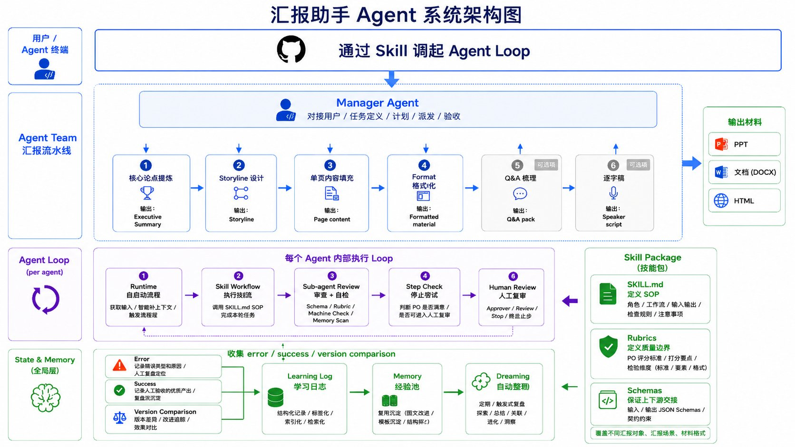
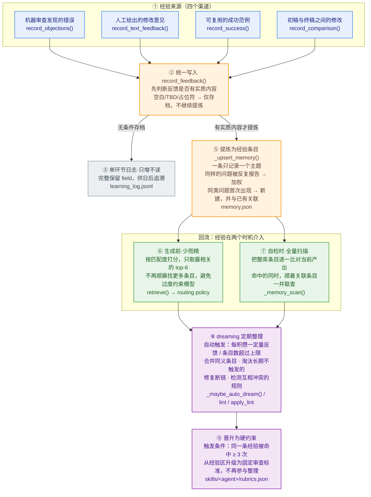

# 汇报助手系统框架介绍


## 一、系统总框架

- **7-Agent 流水线**：汇报助手是一套面向战略汇报生产的 7-Agent Loop Harness，它把汇报材料从任务定位、论点提炼、故事线、单页内容、格式化、Q&A 到逐字稿拆成 7 个独立 Agent。
- **自演进闭环**：每个 Agent 由可编辑 skill 定义工作方式，由 loop 执行、review 拦截、state/memory 持续学习，并通过 Web Cockpit 可视化管理整个 harness。
- **覆盖场景**：支持董事会、总办、战略负责人、业务团队、外部等不同汇报对象，覆盖专题深度分析与信息快速同步两种汇报性质，可产出文档、PPT 或 HTML 三种材料格式。

整体架构如下：



这个系统的核心不是「一个模型一次性写完整汇报」，而是把汇报生产拆成可控的环节：每个环节有明确输入、明确产物、明确审查标准、明确人工放行点，并把过程中的反馈沉淀为后续可复用的 memory。

## 二、7-Agent 流水线模块

核心定义位于 `configs/agents.json`。当前流水线由 7 个 Agent 串联组成：

| 阶段 | Agent | 主要职责 | 核心产物 |
|---|---|---|---|
| 1 | 任务定位 | 把汇报对象、性质、格式、模板、历史材料收敛成可执行 brief | 汇报 brief |
| 2 | 核心论点提炼 | 提炼 Executive Summary、核心结论、关键论点和 action | Executive Summary |
| 3 | Storyline 设计 | 设计每页标题、关键问题、so what、证据安排 | Storyline |
| 4 | 单页内容填充 | 把 storyline 展开成 dummy page 和图表 brief | Page content |
| 5 | Format | 生成 PPT / HTML / 文档形态的正式材料结构 | Formatted material |
| 6 | Q&A 梳理 | 预判追问、风险点、回答策略、待补信息 | Q&A pack |
| 7 | 逐字稿 | 生成完整汇报话术和时间节奏 | Speaker script |

每个 Agent 在配置里声明：

- 输入 schema 与输出 schema；
- 与上下游 Agent 的交接关系；
- memory 维度；
- rubrics 摘要；
- global state 的读取与写入范围；
- review policy；
- harness 状态与可选能力，如 multi-candidate。

这种定义方式让 7 个 Agent 的职责、契约和运行策略集中在配置中，前端也可以直接读取这些信息进行可视化展示。

## 三、单 Agent Loop 的内部结构

每个 Agent 都不是简单的一次生成，而是一个同构 loop。一个 Agent 的标准流程是：

```text
start → workflow → review → stop_check → human_review
```

含义如下：

- `start`：由人或上游 artifact 发起本环节。
- `workflow`：由本 Agent 的 skill 执行生成任务。
- `review`：按 schema、rubrics、machine check、memory scan 审查产物。
- `stop_check`：判断是否已清除 P0，是否可以进入人工 review。
- `human_review`：由人决定 approve、revise、stop 或手动回到上游。

如果有 P0，系统会进入 revise；如果通过 stop check，则停在 human review。这个设计保留了 human-in-the-loop：机器负责拦截硬伤和维护流程，人负责最终判断材料是否可用。

### 3.1 Runtime 模块

Runtime 是 loop 的运行骨架，主要由以下文件实现：

- `presentation_agent/loop.py`：`LoopRunner`，一次性跑单个 Agent 的完整 maker-checker loop。
- `presentation_agent/pipeline.py`：`Pipeline`，把 7 个 Agent 串成完整汇报流水线。
- `presentation_agent/step.py`：`StepRunner` / `PipelineStepper`，支持宿主模型自执行的单步模式。
- `presentation_agent/launch.py`：统一启动入口，负责把自然输入或 brief 标准化后交给 pipeline。

Runtime 负责的不是“写汇报内容”，而是：

- 读取配置和 skill package；
- 装配输入、global state、memory、routing policy；
- 生成 instruction；
- 校验输出 schema；
- 写入 run_state；
- 推进 workflow / review / revise / human_review 状态；
- 产出 artifacts。

因此它是整个 harness 的流程控制层。

### 3.2 Skill 模块

Skill 是每个 Agent 的行为定义层，位于 `skills/<agent_id>/`。

每个 Agent 的 skill 包基本由三类文件组成：

```text
skills/<agent_id>/
├── SKILL.md
├── rubrics.json
└── schemas/*.json
```

三类文件分别负责：

- `SKILL.md`：定义该 Agent 的角色、工作流 SOP、输入理解方式、输出要求和注意事项。
- `rubrics.json`：定义 P0/P1 审查标准，是 review 的核心质量边界。
- `schemas/`：定义输入/输出 JSON 结构契约，保证上下游交接稳定。

运行时由 `presentation_agent/skill_package.py` 读取 skill 包，再由 `presentation_agent/skills/generic.py` 组装 prompt。大多数 Agent 使用通用 `GenericSkill` runtime；`storyline_design` 另有一个样板 runtime：`presentation_agent/skills/storyline.py`。

这种设计的好处是：修改 Agent 行为时，优先改 skill 包，而不是改 Python runtime。SOP、rubrics、schema 都可以独立演进。

Skill 体系覆盖了战略汇报的常见场景，在 `task_positioning` 阶段由 brief 收敛并通过 global state 向下游传递：

| 维度 | 支持范围 |
|---|---|
| 汇报对象 | 董事会、总办汇报、战略负责人、业务负责人和业务团队、外部分享 |
| 汇报性质 | 专题汇报（`deep_dive`）、信息快速同步（`quick_sync`） |
| 材料格式 | 文档（`document`）、PPT（`ppt`）、HTML（`html`） |

Skill 的 SOP 与 rubrics 会根据对象、性质和格式自适应调整审查重点与措辞风格——例如面向董事会时 review 严格度自动 heightened，专题汇报要求完整候选论点比较，PPT 输出触发 mck_ppt 布局引擎。

#### 3.2.1 Connectors 取数层

Connectors 是 skill 可调用的输入准备能力，位于 `presentation_agent/connectors/`。

当前支持：

- `docx.py`：读取 Word 文档，提取段落，并可为 storyline 输入做初步结构化。
- `xlsx.py`：读取 Excel workbook、sheet、行列内容，并转成材料结构。
- `csv.py`：读取 CSV，并把行记录转成 Agent 可消费的 materials。
- `registry.py`：按文件后缀和 Agent spec 选择合适 connector。

Connectors 的定位不是完整数据分析平台，而是把原始素材转成 Agent 可读取的结构化输入。它承担的是 skill 执行中“输入准备”阶段的取数层能力。

#### 3.2.2 Renderers 输出层

Renderers 是 skill 可调用的材料生成能力，位于 `presentation_agent/renderers/`。

当前支持：

- `ppt.py`：把 material units 渲染为 PPT。
- `html.py`：把 material units 渲染为 HTML 页面。
- `docx.py`：把 material units 渲染为 Word 文档。
- `base.py`：定义统一 `RenderResult` 和渲染入口。

Format 与 page filling 阶段产生的 JSON artifact 可以通过 renderers 输出为 PPT、HTML 或 DOCX。项目中还包含 `presentation_agent/vendor/mck_ppt/`，用于提供更专业的 PPT 布局、风格常量、deck builder 和 QA 能力。

这一层是系统从“结构化中间产物”走向“可交付材料”的关键。

### 3.3 Review / Stop Check 模块

Review 与终止判定主要由以下文件实现：

- `presentation_agent/review.py`
- `presentation_agent/machine_check.py`

当前审查体系可以分为三层：

1. **Schema gate**：产物必须符合输出 schema，缺字段或结构错误会形成 P0。
2. **Rubric / machine check**：可机械检查的硬约束由 machine check 执行。
3. **Memory scan**：命中历史 memory 时，作为 P1 提醒进入审查结果。

Stop checker 只判断是否可以停止并进入 human review，不等同于完整质量判断。这里有一个关键分工：

- Review 负责发现问题；
- Stop check 负责判断 P0 是否已经清除；
- Human review 负责最终判断材料能不能用。

这能避免系统假装“全自动判断主观质量”，也符合汇报材料生产中高质量判断必须有人参与的现实。

## 四、State / Memory / Learning 模块

这是当前系统最有自我进化特征的一层。它要解决的核心问题是：汇报材料的"好坏"高度依赖经验，而这些经验散落在每一次审查异议、人工修订、版本演化里。如果不沉淀，系统永远在重复犯同样的错；如果一股脑塞进 prompt，模型又会因为上下文过载而 loss attention。

所以这一层的设计目标不是"记得越多越好"，而是**让正确的经验在正确的时机、以正确的颗粒度生效**。它由四个文件实现，各管一段链路：

| 文件 | 职责 | 在链路中的位置 |
|---|---|---|
| `presentation_agent/memory.py` | 写入、提炼、整理（dreaming）、晋升 | 入口 + 沉淀 + 维护 |
| `presentation_agent/learning.py` | 项目级事件流、版本对比 diff | 横向记录 + 对比信号 |
| `presentation_agent/memory_retrieval.py` | 生成前按相关性召回 | 嵌入生成 |
| `presentation_agent/routing.py` | 把召回结果转成执行旋钮 | 嵌入生成 |

### 4.0 一张图看懂流转链路

整层可以理解为一条**单向沉淀、双时机生效**的链路：各种信号从左侧汇入，逐层提纯，最终在两个不同时机（生成前 / 自检时）回流到 loop。



下面顺着这条链路，逐段讲清楚每一环"输入是什么、做了什么、产物去哪"。

### 4.1 输入渠道：经验从哪里来

系统不假设"经验只来自纠错"。当前有**四类信号源**，全部经由 `memory.py` 的统一写入入口落库：

| 渠道 | 入口方法 | 信号性质 | 典型来源 |
|---|---|---|---|
| 审查异议 | `record_objections()` | 这次哪里不对 | review sub-agent 在 loop 内产出的 P0/P1 异议 |
| 人工自然语言反馈 | `record_text_feedback()` | 人的一句话点评 | human review 里直接写的修改意见 |
| 成功模式 | `record_success()` | 这样做是对的 | 一次做得好的范式，主动正向沉淀 |
| 版本对比 | `record_comparison()` | 演化收敛的方向 | v1 稿 → 终稿的稳定修改方向 |

这里有两个值得强调的设计：

- **正负信号对称**：除了"错误反馈"，系统同样把"成功模式"和"版本演化"当作一等公民。三者最终都汇入同一套 memory，避免只学教训、不学范式。
- **人话能直接进系统**：`record_text_feedback()` 会用标记词（"应该 / 改成 / 不要 / 因为"等）把人的一句话自动切成 problem / change / reason 三段，并通过关键词推断维度（Leadline / 结构 / 证据 / 图表 / 表达 / 版式 / 受众适配 / Action）。人不需要填表，写一句话即可。

另外，与 agent memory 平行还存在一类**全局 state**（`data/global/state.json`）：它记录跨 7 个 Agent 共享的硬约束（受众、目标 action、Executive Summary、页数上限）。它和环节 memory 机制相同但作用域不同——生成时两者并存读取，**环节 memory 不覆盖全局约束**。

### 4.2 进入 learning log：忠实存档，只增不读

所有信号进入 `record_feedback()` 后，**第一件事是无条件写一条 `learning_log.jsonl`**（append-only）。这条冷数据完整保留 problem / reason / change / source / dimension / trigger_scene，是后续追溯"为什么会有某条经验"的唯一事实底座。

这里有一个关键的质量闸门 `_is_substantive()`：

- 全是 TBD、空占位的反馈——**照样写 log**（保证可审计、不丢事实）；
- 但**跳过后续的 memory 提炼**，避免把垃圾规则塞进热区、浪费 dreaming 周期。

与此同时，`record_feedback()` 会向项目级事件流 `data/learning/events.jsonl` 同步记一笔（由 `LearningEventStore` 维护）。事件流是**跨 Agent 的横向流水账**，feedback / success / comparison / dreaming / retrieval / routing 都各记一条，用于全局观测和前端 Learning Loop 视图，不参与生成。

> 小结：log 和 event 都是"只写不读进 prompt"的冷数据。前者是**单 Agent 纵向档案**，后者是**跨 Agent 横向流水**。

### 4.3 沉淀为 memory：从多条 log 提炼原子规则

只有通过 substantive 闸门的反馈，才会经 `_upsert_memory()` 进入热 memory（`memory.json`）。热 memory 是真正会进 prompt 的部分，借用了知识图谱的"原子 + 双向链接"结构。单条 `MemoryItem` 只管一个主题：

```text
id · dimension(维度) · trigger(触发词) · trigger_type
suggestion(可执行建议) · hit_count(命中数) · last_triggered
case_anchors:[L-007,…]   ← 纵向链：memory → log，可追溯"凭什么有这条"
links:[M-015,…]          ← 横向链：memory ↔ memory，把同维度条目连成簇
```

提炼逻辑刻意保持克制：

- **同维度 + 同建议** → 不新建，把这次的 log 挂到已有条目的 `case_anchors`，并 `hit_count + 1`（越被反复印证越"重"）；
- **否则**新建一条原子 memory，并自动与同维度的旧条目互建 `links`，让同一主题（如都属"证据口径"）连成一簇。

这样 memory 始终是"一条一个主题"的短卡片，而不是越长越大的备忘录。维度成簇、双向链接，是后面检索和自检能够"顺藤摸瓜"的结构基础。

### 4.4 嵌入生成：少而精召回 + 弱路由

这是整层最关键的防漂移设计，发生在每次生成 instruction **之前**（`loop.py` 装配阶段）。它分两步：

**第一步 · 相关性召回（`memory_retrieval.py`）**
`MemoryRetriever.retrieve()` 对当前任务上下文打分：

```text
维度匹配 +3.0 ｜ trigger 命中 +1.4 ｜ suggestion 命中 +0.7 ｜ 叠加历史 hit_count
```

**只取 top-6，且不顺横向 links 外扩**——只要本簇最相关的几条。这是有意为之：生成阶段塞太多零散禁忌，会让模型起标题、搭结构时畏手畏脚。

**第二步 · 转成执行旋钮（`routing.py`）**
`build_routing_policy()` 把召回结果转成**轻量旋钮**，而不是直接命令模型怎么写。它只调两个东西：

- `checklist_focus`：本轮重点检查项；
- `review_strictness`：审查严格度（面向高层/董事会的汇报自动 heightened）。

这就是"**弱路由**"原则：routing **绝不自动改 skill、不自动跳流程**，只调整"注意力"和"严格度"。loop 保持可理解、human-in-the-loop 不被架空。最终这些旋钮拼成一段"风格须知"贴进 prompt。

> 一句话：生成前的记忆注入是"**少而精、不外扩、只提醒不接管**"。

### 4.5 自检补漏：全量扫描，命中顺链

光靠生成前召回会漏掉"维度没预判到"的问题。所以在 review 阶段（`review.py` 第 3 层 `_memory_scan()`）采取**相反策略**：

- **全量扫**整库 trigger，不做 top-k 截断；
- **命中后才顺横向 links** 把同簇邻条一起带出核对（例如扫中"绝对化措辞"，顺链把"咨询腔"一并查掉）；
- 结果作为 **P1 提醒**进入审查结果，不直接卡 P0。

这正好补上 4.4 生成时"少而精"留下的盲区。**横向 links 的真正价值落在这里**——用于自检时机械式地顺藤补漏，而不是在生成时塞更多内容。

> 双时机非对称是这层的精髓：**生成时少而精（怕拘束），自检时放开扫（纯核对）**。

### 4.6 dreaming：定期整理，防止 memory 腐化

memory 会越积越乱，所以需要周期性"做梦整理"。`_maybe_auto_dream()` 在**每写满 N 条 log 或热 memory 超过软上限（默认 30 条）**时自动触发，也可手动调 `dream()`。`lint()` / `apply_lint()` 做四件事：

1. **淘汰**长期不触发的沉默条目；
2. **合并**近义重复条目；
3. **修复**断链（orphan_links，指向已删条目的 link）；
4. **检测**潜在冲突（同 trigger 却给出不同 suggestion）。

整理报告落 `memory_dreams/`，对外摘要落 `memory_summary.json`。dreaming 保证热区始终"小而准"。

### 4.7 晋升：高频经验升级为硬约束

`promotion_candidates()` 会挑出 `hit_count ≥ 3` 的条目（阈值来自 `configs/agents.json` 的 `state_policy`）。经人工确认后，`apply_promotion()` 把它升级成 `skills/<agent>/rubrics.json` 里的 `MEM-P1-xxx` 硬约束，并从热 memory 删除。

这样形成一条**按频次自然流动**的生命线：

```text
log（沉底可追溯）→ memory（承接长尾经验）→ rubric（高频固化为硬规则）
```

三层各司其职：rubric 保持精简、memory 承接长尾、log 永远兜底。经验越被反复印证，就越往"硬"的方向沉淀。

### 4.8 核心原则回顾

整层始终遵循四条原则：**轻记忆、重证据、强检索、弱路由**。

- **轻记忆**：不把历史全塞进 prompt，热 memory 始终短小；
- **重证据**：原始事实进 append-only log，每条 memory 都能溯源到具体 case；
- **强检索**：生成前少而精召回、自检时全量扫描，两个时机互补；
- **弱路由**：routing 只调注意力和严格度，绝不自动改 skill 或跳流程。

这套设计让系统能持续学习，又不会因为 memory 过重而 loss attention，同时把最终判断权牢牢留给人。

## 五、接入方式

当前系统可以从两个层面接入外部 agent 或模型能力。

### 5.1 通过 skill 形式接入 Agent 终端

这是面向 Codex、Claude Code、WorkBuddy 等 agent 终端的主接入方式，入口文件为 `skills/report_builder/SKILL.md`——一份自包含、对所有平台通用的 skill（仓库地址已固化，无需为不同平台准备不同模板）。其核心机制可以归结为一句话：**harness 不调模型，宿主调 harness。**

展开来看就三层：

1. **harness 只做三件事**——读配置、写指令文件、校验 JSON。它是一组纯 Python 的 CLI 命令（`step prepare` / `step commit` / `pipeline-advance`），不持有任何模型 API key，也不调用任何模型。
2. **report_builder SKILL.md 教会了宿主 Agent 怎么调用这三条命令**——"用户要汇报时，你依次跑 prepare → 读指令 → 用你自身的模型产出 JSON → 跑 commit → 跑 advance → 重复下一个阶段"。宿主 Agent 读了这个 skill 就知道按什么节奏调度 harness。
3. **7 个阶段只是把这套相同的三命令循环跑了 7 次**——harness 在 `pipeline-advance` 时自动切换到下一个 Agent 的 skill、rubrics、memory，但对宿主 Agent 来说，每次都是完全一样的 prepare / commit / advance 节奏，只是每一轮 harness 给了一份不同的指令单。

#### 核心模式：宿主自执行（host-self-execution）

这条接入路径的关键设计在于**分工解耦**——它不要求 harness 自己调用模型。实际的分工是：

| 角色 | 负责 | 不负责 |
|---|---|---|
| **宿主 Agent**（如 WorkBuddy） | 读指令、理解上下文、产出内容 JSON | 不关心 harness 内部状态如何流转 |
| **Python harness** | 装配指令包、校验 schema、管理 state/memory、推进流程 | 不调用任何模型 |

也就是说，**harness 只是一个无状态的指令装配器 + schema 校验器 + 状态机**。它把每个阶段的"角色说明、输入材料、输出规范、审查红线、相关 memory"组装成一份结构化指令包，交给宿主 Agent 去执行；宿主 Agent 产出 JSON 后，harness 只做两件事——校验 schema 是否合规、按状态机推进流程。

#### 三步协议：prepare → commit → advance

report_builder skill 定义了宿主 Agent 与 harness 之间的一个**三步命令行协议**：

```
① step prepare    →  harness 吐出 instruction_*.md（指令包）
② 宿主读取指令，产出 JSON，写入 output_*.json
③ step commit     →  harness 读取 output，校验 schema，推进状态机
```

② 是宿主 Agent 用自己的模型完成的，① 和 ③ 都是纯 Python 的确定性操作。整个循环由 `StepRunner`（`presentation_agent/step.py`）驱动，其内部状态机为：

```text
init → awaiting_gen_output → gen_completed
  → awaiting_review_output → review_completed
    → [有 P0] awaiting_revise_output → gen_completed（自动返工）
    → [无 P0] done（停留等待人工确认）
```

- **P0 返工**由 harness 自动判定并回到 revise 轮次，宿主 Agent 读到新的 revision 指令后继续产出，不需要额外人工干预。
- **done** 时输出 `present_to_user`（产物摘要 + 审查结果 + 记忆更新），宿主 Agent 将其呈现给用户确认，确认后执行 `pipeline-advance` 进入下一个阶段。

这样一来，7 个 Agent 的完整流水线就可以被宿主 Agent 以**完全相同的 prepare → commit → advance** 节奏逐段驱动，无需 harness 知道每个阶段的具体内容是什么。

#### 对话中的自动记忆沉淀

report_builder skill 还定义了隐式的 memory 记录规则：当阶段停在 human review 且用户给出修改意见时，宿主 Agent 自动调用 `feedback-text` 命令行将原话写入对应阶段 Agent 的 memory，无需用户另外填表。成功范例和版本对比也有对应的 CLI 命令（`success-memory` / `compare-reflect`），宿主 Agent 在恰当的时机主动触发。用户的体验是"对话界面全程无感"，但背后的 memory/learning 闭环在持续运转。

#### 为什么这个设计成立

1. **harness 保持无状态、零模型依赖**：它只是读 schema、写指令、做校验，不持有任何模型 API key，部署门槛极低。
2. **宿主 Agent 的模型就是"最强的那个模型"**：生成和审查由对话里的强模型完成，不需要 harness 自己调度模型去生成。
3. **协议极简**：三个 CLI 命令（prepare / commit / advance）覆盖全部流程控制，宿主 Agent 只需要读懂指令、产出 JSON、交回校验。
4. **memory/learning 闭环对用户透明**：用户在对话里正常提意见，report_builder 自动把反馈沉淀进对应阶段的 memory，下次生成时 harness 装配指令时会注入相关经验。

这也是当前最符合 WorkBuddy / Claude Code / Codex 工作方式的入口——用户体验上是在一个 agent 对话里完整调度整个汇报助手，而非跳转到另一个独立系统。

### 5.2 通过 LLM Adapter / Host Integration 接入模型或执行环境

第二种接入方式是 runtime 内部的模型通道抽象，位于：

```text
presentation_agent/llm/
```

核心文件包括：

- `client.py`：统一的 `LLMClient` 接口。
- `factory.py`：根据配置构造不同 adapter。
- `adapters/mock.py`：离线测试用假模型。
- `adapters/cli.py`：通过外部 CLI 调用模型。
- `adapters/inline.py`：宿主自执行模式使用的 adapter。

这层解决的问题是：harness 内部不绑定某一个模型供应商，而是把“模型调用”抽象成统一接口。这样同一套 loop / skill / review / schema 可以跑在不同执行方式下。

两种接入方式的关系可以这样理解：

| 接入方式 | 面向对象 | 主要入口 | 适合场景 |
|---|---|---|---|
| Skill 形式接入 | Codex / Claude Code / WorkBuddy 等 agent 终端 | `skills/report_builder/SKILL.md` | 人在对话里发起任务，宿主 Agent 调度 harness |
| LLM Adapter 接入 | harness 内部 runtime | `presentation_agent/llm/` | CLI、mock、inline 等不同执行模式统一模型调用 |

前者偏“产品入口 / 使用方式”，后者偏“底层执行抽象”。

## 六、Web Cockpit 前端模块

Web Cockpit 由以下文件实现：

- `presentation_agent/web.py`
- `presentation_agent/web_static/index.html`
- `presentation_agent/web_static/app.js`
- `presentation_agent/web_static/styles.css`

它是当前系统的可视化操作与解释层。现有前端包含几个主要视图：

| 视图 | 作用 |
|---|---|
| Loop Map | 展示 7 个 Agent 的接力关系和单 Agent loop |
| Inline Run | 演示单步执行流程 |
| Agent Detail | 展示每个 Agent 的定位、输入输出契约、state、harness、rubrics |
| Learning Loop | 展示 memory、learning log、event、dreaming、retrieval/routing 机制 |
| Harness Files | 浏览和编辑 configs / skills / data / docs / runtime 文件 |
| Runs | 浏览 artifacts 和运行结果 |

Web Cockpit 不只是一个开发调试工具，也可以逐渐演化成“系统说明中心”：

- 对非技术用户解释 7-Agent 流水线；
- 展示每个 Agent 的职责、输入输出和质量标准；
- 展示 memory 如何持续学习；
- 展示当前 harness 文件和运行产物；
- 支持后续扩展成案例库、版本对比、learning event 浏览、memory dreaming 可视化。

## 七、插件化分发方案

汇报助手的核心价值在于让非技术用户也能用自然语言驱动 7 阶段汇报生成。因此，它不能要求用户安装 Python 环境、执行命令行或理解项目结构。插件化分发方案解决的就是"如何把这套工具交给一个只会对话的人"。

### 如何获取

工具通过 GitHub 仓库分发，地址为 `https://github.com/jonathonsjzhang/presentation-agent`。安装流程已固化在仓库的 `skills/report_builder/SKILL.md` 中，对 WorkBuddy、Codex、Claude Code 等任意具备终端能力的宿主 Agent 通用——无需为不同平台准备不同模板。

在宿主 Agent 终端中发送以下一条自包含指令即可完成安装：

> "请 clone `https://github.com/jonathonsjzhang/presentation-agent`，按照仓库里 `skills/report_builder/SKILL.md` 的说明安装汇报助手并完成初始化。"

宿主 Agent 会自动 clone 仓库、读取 skill、执行 `init-workspace` 和 `doctor` 自检，用户无需接触任何命令行。详细步骤见仓库根目录的 `GUIDEBOOK.md`。

企业内部批量部署时，可将仓库地址写入环境变量 `PRESENTATION_AGENT_REPO_URL`，Agent 优先读取该变量。

### 7.1 整体思路：三层解耦

分发方案将系统拆解为三个独立、互不污染的逻辑层：

```text
宿主 Agent 终端
Codex / Claude Code / WorkBuddy
        │
        │ 薄 skill：只教宿主如何调用 CLI，不复制内部逻辑
        ▼
官方 GitHub 仓库
runtime / configs / skills / templates / CLI
        │
        │ --workspace（数据隔离）
        ▼
用户工作区
memory / runs / artifacts / 用户配置
```

| 层级 | 定位 | 是否随版本更新变化 |
|---|---|---|
| Host Adapter Skill | 教会宿主 Agent 如何安装、更新、调用工具的单页指令 | 是 |
| 官方 Repo | 存放 runtime、7 个 Agent skill、configs、CLI、模板 | 是 |
| 用户 Workspace | 存放用户 memory、runs、artifacts、私有配置 | 否 |

关键设计在于第三层的数据隔离：官方仓库可以 `git pull` 更新，`git pull` 操作的对象仅为 repo 目录，workspace 不受任何覆盖或删除。用户的汇报记录、积累的记忆、过往产物均完整保留。

### 7.2 本地目录结构

安装完成后用户的计算机上会生成以下结构：

```text
~/PresentationAgent/
├── repo/                           # 官方 GitHub 仓库 clone
│   ├── presentation_agent/         # Python harness
│   ├── configs/                    # Agent 定义与状态策略
│   ├── skills/                     # 7 个 Agent skill + report_builder
│   ├── templates/                  # 各平台 host adapter 模板
│   └── docs/                       # 用户指南与设计文档
└── workspaces/
    └── default/
        ├── data/                   # memory、learning log、全局 state
        ├── runs/                   # 每次汇报的产物与中间文件
        └── artifacts/              # brief 与导出材料
```

Workspace 的定位通过四级优先级判定：CLI 参数 `--workspace` → 环境变量 `PRESENTATION_AGENT_WORKSPACE` → 向上搜寻 `.presentation-agent` 标记文件 → 默认回落 `~/PresentationAgent/workspaces/default`。无论用户是否显式指定，所有命令的写入目标始终一致。

### 7.3 高层 CLI：宿主只需5个命令

为了让宿主 Agent 无需理解内部 7 阶段流水线、step runner、状态机等复杂细节，系统提供了一组高层 CLI 命令对内部逻辑做封装：

| 命令 | 用途 | 内部映射 |
|---|---|---|
| `report start` | 启动一次新的汇报 | `pipeline-init` → 首个阶段 `step prepare` |
| `report next` | 获取当前阶段的指令文件路径 | `step read`：返回 `instruction_path` / `output_path` |
| `report submit` | 提交宿主产出的 JSON 并自动校验 | 写入 output → `step commit` → 自动判定 P0 返工或 done |
| `report approve` | 确认当前阶段，推进到下一阶段 | `pipeline-advance` |
| `report status` | 查询当前汇报的状态和进度 | 聚合 run state 摘要 |

对于宿主 Agent 而言，一次完整的 7 阶段汇报就是反复执行以下三步循环：

```text
report next  →  读取指令，用自身模型产出 JSON  →  report submit  →  done 后 report approve
```

每一步的内部校验（schema 合规、P0 硬门、机器检查、记忆扫描）全部由 harness 自动执行，宿主 Agent 只关心"指令是什么"和"产出是否被接受"。

### 7.4 Host Adapter Skill：单一自包含 skill

宿主 Agent 的全部接入逻辑收敛在一份 skill 文件 `skills/report_builder/SKILL.md` 中，对所有平台通用，无需为 WorkBuddy / Codex / Claude Code 分别维护模板。它是一份薄适配器，仅包含：

- 固化的仓库地址（支持 `PRESENTATION_AGENT_REPO_URL` 环境变量覆盖）
- 安装与更新流程（`git clone` / `git pull` + `init-workspace` + `doctor`）
- 高层 CLI 调度规则（上述 5 个命令的调用节奏）
- 场景化的 memory 沉淀触发（人审改意见自动记入对应阶段）
- 安全边界（不覆盖 workspace、不写死本机路径、不放 API key）

由于 skill 自包含且仓库地址固化，用户在宿主 Agent 中发送一条安装指令，Agent 即可自动 clone 仓库、读取该 skill 并完成初始化，全程无需手动复制文件或区分平台。

### 7.5 为什么这对非技术用户是低门槛的

整个分发的设计目标可以概括为一句话：**用户只需要说话，Agent 执行一切。**

落地的具体保障包括以下几点：

- **零环境依赖要求**：用户不需要安装 Python、Git 或任何依赖。宿主 Agent 会在后台判断环境是否就绪，自检通过 `doctor` 命令给出明确诊断。
- **无需理解项目结构**：repo 和 workspace 的目录位置是标准化的（`~/PresentationAgent/`），但用户不需要知道或访问。所有文件操作由 Agent 代为完成。
- **无需填写表单**：用户的修改意见以对话原话形式自动沉淀为 memory，不需要切换到另一个界面填写反馈。
- **repo 与 workspace 分离**：版本更新（`git pull`）不会覆盖用户数据。用户每次做汇报积累的记忆和经验持续有效。
- **三条命令完成一次汇报**：安装一条话、发起汇报一条话、修改反馈就是正常对话。用户界面始终只是与一个 AI Agent 的聊天窗口。

## 八、TODOs

当前系统已完成 v0 MVP 架构与插件化分发，后续迭代方向包括：

1. 框架优化：
- **多Agent 和 Sub_agent机制**：当前的多阶段生成和 review 实际由同一个 agent 进行，在不同阶段使用不同skill，存在上下文积累，导致上下文漂移和执行效率、效果较差。
- **项目接入**：当前采用自行部署 Git 包 + skill的方式进行调用，方式复杂且不易于版本管理，需讨论如何接入WB官方插件库。

2. 知识迭代：
- **Skill 多轮迭代**：当前 7 个 Agent 的 skill 包均为初版，需在实际使用中持续迭代 SOP 和 rubrics，并将各 Agent 的 skill 按汇报对象（董事会、总办、战略负责人、业务团队、外部）、汇报性质（专题深度分析与信息快速同步）和材料格式（文档、PPT、HTML）拆成多个原子能力。Agent 调用时根据 brief 参数自由组装组合，增强单次任务表现。
- **注入先验 Memory**：为系统预置一批经过验证的基础 memory（如战略汇报常见措辞偏好、高频 P0 红线等），让首次使用的用户也能获得一定的审查与风格引导，而非从零积累全部经验。
- **评测**：定义评测标准和实验场景，对系统进行自动化评测。