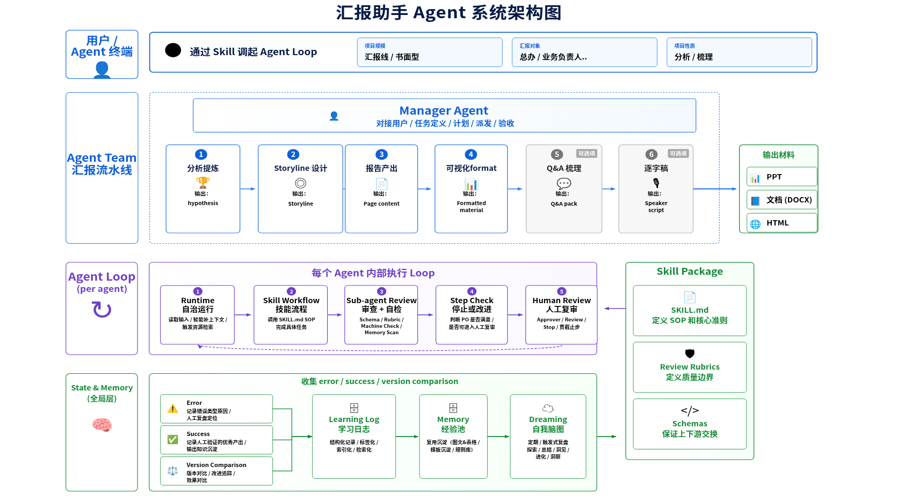
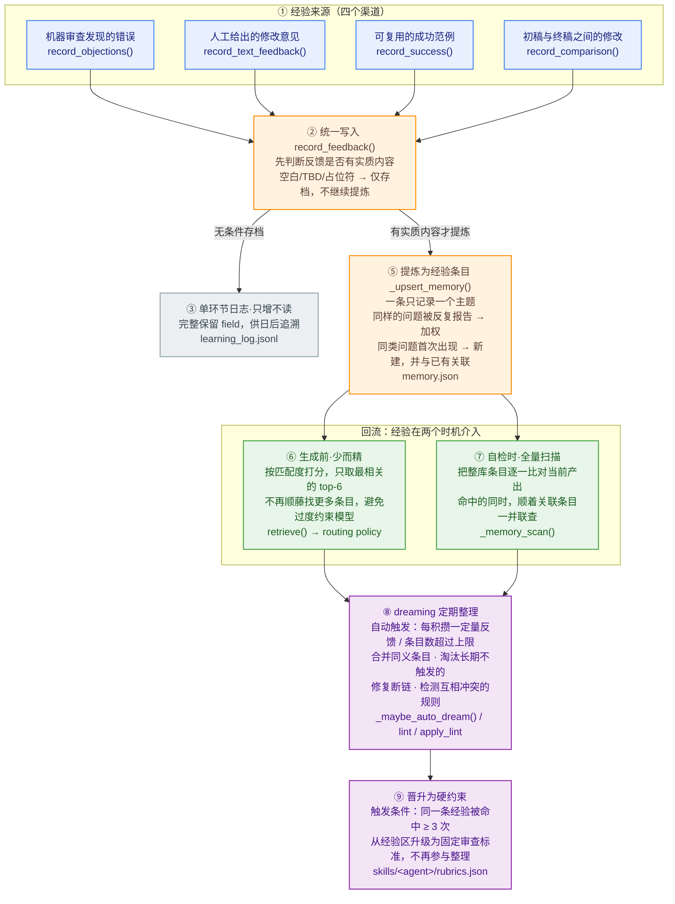

# 汇报助手系统框架介绍

> 当前版本：`v0.3`

## 一、系统总框架

- **Manager + 5 默认 Worker**：Manager 直接面向用户，负责任务定义、计划、派发、验收和返工；五个 Worker 模拟人类分析师从“把材料想明白”到“把观点讲清楚、补上会场追问并做成交付物”的工作流：Analysis 发现、验证并收敛观点，Storyline 选择主线并组织论证，Report 完成正式写作，Q&A 在报告末尾追加高影响深度追问，Format 完成载体化表达。
- **自演进闭环**：每个 Agent 由可编辑 skill 定义工作方式，由 loop 执行、review 拦截、state/memory 持续学习，并通过 Web Cockpit 可视化管理整个 harness。
- **覆盖场景**：支持董事会、总办、战略负责人、业务团队、外部等不同汇报对象，覆盖专题深度分析、业务进展汇报与信息快速同步三种汇报性质，可产出文档、PPT 或 HTML 三种材料格式。

整体架构如下：



这个系统的核心不是「一个模型一次性写完整汇报」，也不是固定地依次跑完所有阶段，而是由 Manager 围绕汇报目标动态拆解任务，为 Worker 声明明确输入、产物和验收标准，并把过程反馈沉淀为后续可复用的 memory。

## 二、版本进展与 TODOs

### 2.1 版本进展

`0.x` 用于框架快速迭代阶段，每个次版本对应一次明确的能力升级。后续版本按倒序追加，保留历史记录。

#### v0.3（2026-07-02）

- **五阶段默认主链**：`analysis → storyline → report → qa_preparation → format`。
- **Evidence 前置输入处理**：有文件、目录或原始数据时，Manager 在 Brief 确认前按需调用 run-level Evidence Harvester；Analysis 复用 Catalog，不占用五阶段 execution plan。
- **材料格式**：Evidence Intake 可递归处理目录，并读取 DOC/DOCX、PDF、XLSX、CSV、JSON、TXT、Markdown 和 PNG/JPG/JPEG。
- **完整 Markdown 原稿层**：Report 基于已批准 Storyline 写出 canonical `report.md`；Worker 只提交 `report_markdown`。
- **三载体格式化**：Format Worker 只选择必要视觉；runtime 在不重写、不删减、不调序原稿的前提下排版为 DOCX、PPT 或 HTML。
- **单一活动契约**：v0.3 是唯一运行 profile，run state 会校验契约版本，避免错误恢复。
- **收尾扩展 gate**：逐字稿 worker 已移除；PPT/HTML 作为载体扩展，在默认五阶段完成后按需追加。

#### v0.2（2026-06-30）

- **可组合原子能力**：专业 Worker 按受众、汇报性质和材料格式编译当轮所需 Skill bundle，支持 fingerprint 与 prompt budget。
- **投影上下文与 scoped memory**：Manager 按 Worker 投影上游 artifact；memory 按 capability owner 和 profile scope 检索，并可晋升到对应 atomic rubric。
- **三载体 Format**：PPT、DOCX、HTML 分别加载独立执行规则、工具与 renderer 校验。
- **E2E 自动评测脚手架**：冻结独立 rubric，通过 Content Judge + Visual Judge 评价最终材料；PPT、DOCX、HTML 均生成格式适配的视觉快照，缺少截图时阻断评测放行。

#### v0.1（2026-06-29）

- **Manager + Worker 架构**：将原 7-Agent 串行流水线升级为 Manager 控制面 + 专业 Worker 模式，由 Manager 负责任务定义、动态派发、返工和整体验收。
- **Agent Team 调度**：新增面向 WorkBuddy、Codex、Claude Code 等终端的调度协议，支持 sub-agent 隔离与并发执行，并由 Manager 汇总结果、统一验收。

### 2.2 后续 TODO

1. **框架优化**
   - **真实模型评测**：在 E2E Eval Harness 基础上补充 benchmark cases、人工校准集、旧/新 pairwise 盲评、真实 run token 采样和 CI/nightly suite。
   - **项目接入**：当前主要通过自行部署 Git 仓库和 Host Skill 使用，安装、升级与版本管理仍有成本；后续需要评估接入 WorkBuddy 官方插件库或统一插件分发体系。

2. **知识迭代**
   - **持续迭代 SOP 与 rubrics**：当前 Manager 与专业 Worker 的 Skill 仍需结合真实汇报任务持续校准职责边界、工作流、验收标准和返工策略。
   - **注入先验 Memory**：预置一批经过验证的基础经验，例如战略汇报常见措辞偏好、受众关注点和高频质量红线，使首次使用者也能获得稳定的生成与审查引导。

## 三、Manager 与专业 Worker

核心定义位于 `configs/agents.json`。Manager 是控制面 Agent，原任务定位 Agent 的能力已并入 Manager 的 `report_charter`；其余 Agent 是可调度 Worker：

| 类型 | Agent | 主要职责 | 核心产物 |
|---|---|---|---|
| 控制面 | Manager | 定义任务、派发 Worker、验收、返工和完结；固定 execution plan 由 runtime 生成 | Report charter、task packet、acceptance decision |
| 输入处理任务 | Evidence Harvester | Brief 确认前读取、拆分、提取和索引材料；不形成战略判断 | Evidence Catalog |
| Worker | Analysis（观点发现与收敛） | 通读参考材料，发散可能的发现、解释与假设，经过比较、追问和证据检验后，收敛成一组重要且站得住的发现与观点；负责把材料想明白，但不决定汇报的唯一主线 | `analysis.v1` |
| Worker | Storyline（故事线设计） | 面向汇报目标和受众，从 Analysis 的观点中选择核心主张，取舍信息并组织成一条递进、可说服的论证链；负责把观点讲成故事，但不重新分析材料或撰写完整正文 | `storyline.v3` |
| Worker | Report（正式写作） | 基于已批准 Storyline，把论证骨架写成一篇完整、有开头、有推进、有收束、可以从头读到尾的 Markdown 报告 | `report.v1`、`report.md` |
| Worker | Q&A 梳理 | 基于完整 Markdown 报告和汇报对象，追加一组重要、深度、关乎逻辑与底层论据的听众追问；不写答案、不准备话术 | `report.v1`（追加问题清单后的 `report_markdown`） |
| Worker | Format（载体化表达） | 以追加追问后的 `report.md` 为内容真相源，只改变标题层级、字体、间距、分页、图表、表格和载体实现，不重写或删减报告 | `formatted_material.v2`、DOCX/PPTX/HTML |

每个 Agent 在配置里声明：

- 输入 schema 与输出 schema；
- 与上下游 Agent 的交接关系；
- memory 维度；
- rubrics 摘要；
- global state 的读取与写入范围；
- review policy；
- harness 状态与可选能力，如 multi-candidate。

v0.3 的默认生产依赖固定为 `analysis → storyline → report → qa_preparation → format`。Manager 可以派发返工，但不能把 Evidence 插入五阶段生产主链；Evidence 在有原始材料时作为 Brief 前的 run-level 输入处理任务运行，生成的 Catalog 由 Brief Gate 和 Analysis 共同复用。Analysis 内原触发仅保留为旧 run 或直接调用的兼容兜底。逐字稿 worker 已删除，不再出现在默认链路、扩展 gate 或 task packet 枚举中。

## 四、双层 Loop

外层 Manager loop：

```text
brief gate → planning → auto-dispatch worker → acceptance
  → dispatch / revise / ask_human / complete → final human gate
```

内层 Worker loop：

```text
workflow → review → stop_check → revise 或返回 Manager
```

Worker checker 负责本专业 schema 和 rubrics；Manager 负责对照项目目标和跨任务依赖验收。默认由用户审核 Manager，而不是逐个审核 Worker。

验收遵循“判断归判断、执行归执行”的边界：schema、当前 task 绑定和真实文件是否生成属于 runtime 硬约束；跨阶段一致性、命题收窄、caveat 是否足够等语义检查作为 Manager 的验收信号，不由 runtime 越权反复拒绝 Manager 决策。`acceptance_report.task_id` 等流程 bookkeeping 由 runtime 绑定当前任务，避免 feedback → revise 后的旧状态阻塞后续 dispatch/complete。

v0.3 进一步把固定路由 bookkeeping 从 Manager 输出中收回 runtime：acceptance 只需给出 action 与 acceptance_report；dispatch/revise 的 task packet 缺失时由 runtime 自动生成，存在时也会把下一 Worker 和 `input_artifacts` 规范化为当前任务注册的正式 `artifact.json`。旧版决策若引用 `handoff/output_*.json`，resolver 会优先映射到同任务根目录的 `artifact.json`。决策校验通过但应用失败时，提交事务会回滚到 `awaiting_output`，宿主可直接 `report next` 后修正并重提，不会停在 `decision_committed + human_gate:null`。

### 4.1 Runtime 模块

Runtime 是 loop 的运行骨架，主要由以下文件实现：

- `presentation_agent/loop.py`：`LoopRunner`，一次性跑单个 Agent 的完整 maker-checker loop。
- `presentation_agent/manager.py`：`ManagerAgentRuntime`、`ManagerOrchestrator`、`WorkerExecutor`，组成控制面和动态调度状态机。
- `presentation_agent/pipeline.py`：五阶段固定顺序的调试入口；用户交付默认走 Manager。
- `presentation_agent/step.py`：`StepRunner` / `PipelineStepper`，支持宿主模型自执行的单步模式。
- `presentation_agent/launch.py`：统一启动入口，负责把自然输入或 brief 标准化后交给 pipeline。

Runtime 负责的不是“写汇报内容”，而是：

- 读取配置和 skill package；
- 装配输入、global state、memory、routing policy；
- 生成 instruction；
- 校验输出 schema；
- 写入 run_state；
- 推进 workflow / review / revise / human_review 状态；
- 产出 artifacts。

因此它是整个 harness 的流程控制层。

### 4.2 Skill 模块

Skill 是每个 Agent 的行为定义层，位于 `skills/<agent_id>/`。Manager 也有完整的 `skills/manager/`，不是写死在 Python 中的流程规则。

每个 Agent 的 skill 包基本由三类文件组成：

```text
skills/<agent_id>/
├── SKILL.md
├── rubrics.json
└── schemas/*.json
```

三类文件分别负责：

- `SKILL.md`：定义该 Agent 的角色、工作流 SOP、输入理解方式、输出要求和注意事项。
- `rubrics.json`：定义 P0/P1 审查标准，是 review 的核心质量边界。
- `schemas/`：定义输入/输出 JSON 结构契约，保证上下游交接稳定。

运行时由 `presentation_agent/skill_package.py` 读取 skill 包，再由 `presentation_agent/skills/generic.py` 组装 prompt。所有 Worker 使用通用 `GenericSkill` runtime；`presentation_agent/skills/storyline.py` 只保留为直接调用场景下的安全 fallback，不负责选择固定 Story Arc。

这种设计的好处是：修改 Agent 行为时，优先改 skill 包，而不是改 Python runtime。SOP、rubrics、schema 都可以独立演进。

五个 Worker 对应两次内容收敛、一次原稿写作、一次会场追问补强和一次表达加工：Analysis 先从大量材料中发散并验证可能的发现、解释和假设，再收敛为观点池和 2-3 组可确认的主论点方案；Storyline 从用户确认的论点组和观点池中选择唯一主线，形成 Executive Summary、动态 message pyramid 和章节论证顺序；Report 把故事线写成完整正文，展开主张—证据链、方法、反方、caveat、来源与附录；Q&A 站在听众视角追加会真正挑战逻辑和底层论据的深度问题；Format 再把语义完整的报告转译为目标载体，完成信息层级、图表和版式设计。简言之，Analysis 负责把材料想明白并给出可选论点组，Storyline 负责把被确认的观点讲成故事，Report 负责把故事写成报告，Q&A 负责补上重要追问，Format 负责把报告做成可交付材料。任何下游 Worker 都不能静默补做上游工作；证据或观点无法支撑时必须明确返回上一环补齐。

可视化论据沿同一条链路传递：Evidence 保留完整数据和数据资产引用，Analysis 判断哪些核心论据必须被看见，Storyline 决定放在开头还是具体章节，Report 写入位置标记，Q&A 原样保留，Format 选择图表或表格并生成。Runtime 会逐项检查必需项目；缺图、位置错误或缺少可绘制数据时停止交付，并把任务返回到真正需要补充的环节。

Skill 体系覆盖了战略汇报的常见场景，由 Manager planning 收敛为 `report_charter` 并通过 task packet 和 global state 向 Worker 传递：

| 维度 | 支持范围 |
|---|---|
| 汇报对象 | 董事会、总办汇报、战略负责人、业务负责人和业务团队、外部分享 |
| 汇报性质 | 专题汇报（`deep_dive`）、业务进展汇报（`business_progress`）、信息快速同步（`quick_sync`） |
| 材料格式 | 文档（`document`）、PPT（`ppt`）、HTML（`html`） |

开头的 Brief gate 会确认七类信息：项目需求（研究目的、当前研究 hypo）、高可信论据、报告主题、听众、项目类型、交付形式和报告篇幅。首次 Brief gate 固定在一次 `AskUserQuestion` 中呈现 4 题：研究目的、当前研究 hypo、高可信论据、Brief 是否准确；前三题即使草案已有推断值也必须询问，且保持 `options=[]`，宿主不得添加“用户提供/用户填写”占位选项。四题答案通过 `report feedback` 以结构化 JSON 写回 `raw_brief.json`，其中 `brief_confirmed=true` 代表用户已在同一面板明确确认，无需再弹第二个确认面板。每次 human gate 都返回 `interaction_required`、`preferred_tool=AskUserQuestion` 和可直接透传的 `ask_user_question_payload`；WorkBuddy host 必须实际调用该工具，不能只展示问题文本。未获得明确确认时，runtime 拒绝 approve。研究目的与当前研究 hypo 不从 `decision_goal` / `expected_action` 等背景字段预设；高可信论据由 agent 根据输入材料整理成 evidence list，并让用户填写编号、名称或原文片段。报告主题由 Manager 根据输入与论据总结，听众/项目类型/交付形式/报告篇幅则从用户原始输入提取，缺省为总办、分析类、文档、3 页；若用户选择 PPT，篇幅缺省为 10 页 PPT。Brief 还展示固定 agent 执行流程 `analysis（分析） → storyline（故事线） → report（报告产出） → qa_preparation（追问清单） → format（可视化排版）`，默认不询问 worker 选择或 full_auto mode；review sub_agent 默认不发起，并在 Brief 中显示“否（更高效）”。运行时默认在 Analysis 和 Storyline 完成后各暂停一次：Analysis gate 让用户确认主论点组，若用户选择“都不好”或“我自己修改”会复用当前 Analysis task 修订并再次确认；Storyline gate 以“序号、章节、标题（Leadline）、核心论证”四列表格展示 worker 产出的真实章节故事线，用户确认后进入 Report，若选择“不好，重新写”或“我自己修改”会复用当前 Storyline task 修订并再次确认。

Skill 的 SOP 与 rubrics 会根据对象、性质和格式自适应调整审查重点与措辞风格——例如面向董事会时 review 严格度自动 heightened，专题汇报要求完整候选论点比较，PPT 输出触发 mck_ppt 布局引擎。

专业 Worker 会确定性编译 `core worker + audience atomic capability + report-type atomic capability + format atomic capability`，并把 fingerprint、规则集合和 prompt budget 固化到 run 目录。Manager 使用 projected context：上游 artifact 按来源命名空间化，只内联当前 Worker 需要的字段；Analysis 所需证据字段若只剩 preview 会被输入完整性门禁阻断。Format Worker 一次只处理 document、PPT 或 HTML 中的一个 delivery target。

#### 4.2.1 Connectors 取数层

Connectors 是 skill 可调用的输入准备能力，位于 `presentation_agent/connectors/`。

当前支持：

- `docx.py`：读取 Word 文档，提取段落，并可为 storyline 输入做初步结构化。
- `xlsx.py`：读取 Excel workbook、sheet、行列内容，并转成材料结构。
- `csv.py`：读取 CSV，并把行记录转成 Agent 可消费的 materials。
- `registry.py`：按文件后缀和 Agent spec 选择合适 connector。

宿主只登记原始文件路径，不直接用通用 Read 打开 XLSX，也不运行 openpyxl 后把整表输出到对话。XLSX connector 会在 Evidence Intake 前生成受控的 source-unit 预览、`data_profile` / `data_assets` 和完整 JSON sidecar；大表的下游回查按 sheet/字段切片读取 sidecar，避免二进制不可读和一次性输出被截断。

Connectors 的定位不是完整数据分析平台，而是把原始素材转成 Agent 可读取的结构化输入。它承担的是 skill 执行中“输入准备”阶段的取数层能力。

#### 4.2.2 Renderers 输出层

Renderers 是 skill 可调用的材料生成能力，位于 `presentation_agent/renderers/`。

当前支持：

- `formatted_document_v2.py`：把 Report 与 `formatted_material.v2` 渲染为精装 Word 报告。
- `ppt.py`：把 Format delivery units 渲染为 PPT。
- `html.py`：把 Format delivery units 渲染为 HTML。
- `base.py`：定义统一 `RenderResult` 和渲染入口。

Report 先物化内容正确的 `report.md`；Q&A 只在末尾追加深度追问清单；Format Worker 完成自身 schema/review loop 后，runtime 立即把增强后的同一原稿排版为 DOCX、PPT 或 HTML，再把 `render_result` 与 `rendered_files` 一并交给 Manager 验收。Manager complete 的硬条件是正式文件真实存在，而不是所有语义检查都零告警。项目中还包含 `presentation_agent/vendor/mck_ppt/`，用于提供 PPT 布局、风格常量、deck builder 和视觉 QA 能力。

这一层是系统从“结构化中间产物”走向“可交付材料”的关键。

### 4.3 Review / Stop Check 模块

Review 与终止判定主要由以下文件实现：

- `presentation_agent/review.py`
- `presentation_agent/machine_check.py`

当前审查体系可以分为三层：

1. **Schema gate**：产物必须符合输出 schema，缺字段或结构错误会形成 P0。
2. **Rubric / machine check**：可机械检查的硬约束由 machine check 执行。
3. **Memory scan**：命中历史 memory 时，作为 P1 提醒进入审查结果。

Stop checker 只判断是否可以停止并进入 human review，不等同于完整质量判断。这里有一个关键分工：

- Review 负责发现问题；
- Stop check 负责判断 P0 是否已经清除；
- Human review 负责最终判断材料能不能用。

这能避免系统假装"全自动判断主观质量"，也符合汇报材料生产中高质量判断必须有人参与的现实。

> **注意**：Manager 编排路径（宿主自执行模式）下的 `StopChecker` 仅做确定性判定（P0 数量、schema 匹配），不做独立 LLM sanity check。LLM 级别的合理性扫描在 review 阶段由独立 Reviewer sub-agent 完成；若用户在 Brief gate 选择快速模式，则只执行 schema 与确定性检查。

### 4.4 E2E Eval Harness

生产 review 用于拦截单个 Worker 的 schema / P0 / P1 问题；E2E Eval Harness 独立评价最终 PPT、DOCX 或 HTML 是否达到正式汇报质量。两套 rubric 分离，避免生产 Agent 既生成、又自审、又改变 benchmark。

评测入口为：

```text
eval start → content judge → eval submit → visual judge → eval submit → aggregate
```

核心实现：

- `presentation_agent/evaluation/adapters.py`：按格式提取文本并生成逐页视觉快照。
- `presentation_agent/evaluation/runner.py`：冻结 rubric、生成 Judge instruction、校验输出、推进状态并聚合评分。
- `evals/rubrics/`：版本化 E2E rubric；每次 run 会保存独立快照。
- `evals/schemas/`：Judge 输出契约。
- `skills/evaluator/SKILL.md`：WorkBuddy / Codex / Claude Code 的 host-self-execution 协议。

PPT/DOCX 通过 LibreOffice/PDF 渲染为逐页 PNG；HTML 通过 Playwright 按页面模块或视口生成截图。Visual Judge 必须检查所有图片，视觉快照缺失会触发 blocking hard gate，不能退化为只读文本评分。

## 五、State / Memory / Learning 模块

这是当前系统最有自我进化特征的一层。它要解决的核心问题是：汇报材料的"好坏"高度依赖经验，而这些经验散落在每一次审查异议、人工修订、版本演化里。如果不沉淀，系统永远在重复犯同样的错；如果一股脑塞进 prompt，模型又会因为上下文过载而 loss attention。

所以这一层的设计目标不是"记得越多越好"，而是**让正确的经验在正确的时机、以正确的颗粒度生效**。它由四个文件实现，各管一段链路：

| 文件 | 职责 | 在链路中的位置 |
|---|---|---|
| `presentation_agent/memory.py` | 写入、提炼、整理（dreaming）、晋升 | 入口 + 沉淀 + 维护 |
| `presentation_agent/learning.py` | 项目级事件流、版本对比 diff | 横向记录 + 对比信号 |
| `presentation_agent/memory_retrieval.py` | 生成前按相关性召回 | 嵌入生成 |
| `presentation_agent/routing.py` | 把召回结果转成执行旋钮 | 嵌入生成 |

### 5.0 一张图看懂流转链路

整层可以理解为一条**单向沉淀、双时机生效**的链路：各种信号从左侧汇入，逐层提纯，最终在两个不同时机（生成前 / 自检时）回流到 loop。



下面顺着这条链路，逐段讲清楚每一环"输入是什么、做了什么、产物去哪"。

### 5.1 输入渠道：经验从哪里来

系统不假设"经验只来自纠错"。当前有**四类信号源**，全部经由 `memory.py` 的统一写入入口落库：

| 渠道 | 入口方法 | 信号性质 | 典型来源 |
|---|---|---|---|
| 审查异议 | `record_objections()` | 这次哪里不对 | review sub-agent 在 loop 内产出的 P0/P1 异议 |
| 人工自然语言反馈 | `record_text_feedback()` | 人的一句话点评 | human review 里直接写的修改意见 |
| 成功模式 | `record_success()` | 这样做是对的 | 一次做得好的范式，主动正向沉淀 |
| 版本对比 | `record_comparison()` | 演化收敛的方向 | v1 稿 → 终稿的稳定修改方向 |

这里有两个值得强调的设计：

- **正负信号对称**：除了"错误反馈"，系统同样把"成功模式"和"版本演化"当作一等公民。三者最终都汇入同一套 memory，避免只学教训、不学范式。
- **人话能直接进系统**：`record_text_feedback()` 会用标记词（"应该 / 改成 / 不要 / 因为"等）把人的一句话自动切成 problem / change / reason 三段，并通过关键词推断维度（Leadline / 结构 / 证据 / 图表 / 表达 / 版式 / 受众适配 / Action）。人不需要填表，写一句话即可。

另外，与 agent memory 平行还存在一类**项目 state**（每个 run 下的 `state.json`）：它记录 Manager 定义、跨 Worker 共享的硬约束（受众、目标 action、Executive Summary、页数上限）。它和环节 memory 机制相同但作用域不同，**环节 memory 不覆盖项目约束**。

### 5.2 进入 learning log：忠实存档，只增不读

所有信号进入 `record_feedback()` 后，**第一件事是无条件写一条 `learning_log.jsonl`**（append-only）。这条冷数据完整保留 problem / reason / change / source / dimension / trigger_scene，是后续追溯"为什么会有某条经验"的唯一事实底座。

这里有一个关键的质量闸门 `_is_substantive()`：

- 全是 TBD、空占位的反馈——**照样写 log**（保证可审计、不丢事实）；
- 但**跳过后续的 memory 提炼**，避免把垃圾规则塞进热区、浪费 dreaming 周期。

与此同时，`record_feedback()` 会向项目级事件流 `data/learning/events.jsonl` 同步记一笔（由 `LearningEventStore` 维护）。事件流是**跨 Agent 的横向流水账**，feedback / success / comparison / dreaming / retrieval / routing 都各记一条，用于全局观测和前端 Learning Loop 视图，不参与生成。

> 小结：log 和 event 都是"只写不读进 prompt"的冷数据。前者是**单 Agent 纵向档案**，后者是**跨 Agent 横向流水**。

### 5.3 沉淀为 memory：从多条 log 提炼原子规则

只有通过 substantive 闸门的反馈，才会经 `_upsert_memory()` 进入热 memory（`memory.json`）。热 memory 是真正会进 prompt 的部分，借用了知识图谱的"原子 + 双向链接"结构。单条 `MemoryItem` 只管一个主题：

```text
id · dimension(维度) · trigger(触发词) · trigger_type
suggestion(可执行建议) · hit_count(命中数) · last_triggered
case_anchors:[L-007,…]   ← 纵向链：memory → log，可追溯"凭什么有这条"
links:[M-015,…]          ← 横向链：memory ↔ memory，把同维度条目连成簇
```

提炼逻辑刻意保持克制：

- **同维度 + 同建议** → 不新建，把这次的 log 挂到已有条目的 `case_anchors`，并 `hit_count + 1`（越被反复印证越"重"）；
- **否则**新建一条原子 memory，并自动与同维度的旧条目互建 `links`，让同一主题（如都属"证据口径"）连成一簇。

这样 memory 始终是"一条一个主题"的短卡片，而不是越长越大的备忘录。维度成簇、双向链接，是后面检索和自检能够"顺藤摸瓜"的结构基础。

### 5.4 嵌入生成：少而精召回 + 弱路由

这是整层最关键的防漂移设计，发生在每次生成 instruction **之前**（`loop.py` 装配阶段）。它分两步：

**第一步 · 相关性召回（`memory_retrieval.py`）**
`MemoryRetriever.retrieve()` 对当前任务上下文打分：

```text
维度匹配 +3.0 ｜ trigger 命中 +1.4 ｜ suggestion 命中 +0.7 ｜ 叠加历史 hit_count
```

**只取 top-6，且不顺横向 links 外扩**——只要本簇最相关的几条。这是有意为之：生成阶段塞太多零散禁忌，会让模型起标题、搭结构时畏手畏脚。

**第二步 · 转成执行旋钮（`routing.py`）**
`build_routing_policy()` 把召回结果转成**轻量旋钮**，而不是直接命令模型怎么写。它只调两个东西：

- `checklist_focus`：本轮重点检查项；
- `review_strictness`：审查严格度（面向高层/董事会的汇报自动 heightened）。

这就是"**弱路由**"原则：routing **绝不自动改 skill、不自动跳流程**，只调整"注意力"和"严格度"。loop 保持可理解、human-in-the-loop 不被架空。最终这些旋钮拼成一段"风格须知"贴进 prompt。

> 一句话：生成前的记忆注入是"**少而精、不外扩、只提醒不接管**"。

### 5.5 自检补漏：全量扫描，命中顺链

光靠生成前召回会漏掉"维度没预判到"的问题。所以在 review 阶段（`review.py` 第 3 层 `_memory_scan()`）采取**相反策略**：

- **全量扫**整库 trigger，不做 top-k 截断；
- **命中后才顺横向 links** 把同簇邻条一起带出核对（例如扫中"绝对化措辞"，顺链把"咨询腔"一并查掉）；
- 结果作为 **P1 提醒**进入审查结果，不直接卡 P0。

这正好补上 4.4 生成时"少而精"留下的盲区。**横向 links 的真正价值落在这里**——用于自检时机械式地顺藤补漏，而不是在生成时塞更多内容。

> 双时机非对称是这层的精髓：**生成时少而精（怕拘束），自检时放开扫（纯核对）**。

### 5.6 dreaming：定期整理，防止 memory 腐化

memory 会越积越乱，所以需要周期性"做梦整理"。`_maybe_auto_dream()` 在**每写满 N 条 log 或热 memory 超过软上限（默认 30 条）**时自动触发，也可手动调 `dream()`。`lint()` / `apply_lint()` 做四件事：

1. **淘汰**长期不触发的沉默条目；
2. **合并**近义重复条目；
3. **修复**断链（orphan_links，指向已删条目的 link）；
4. **检测**潜在冲突（同 trigger 却给出不同 suggestion）。

整理报告落 `memory_dreams/`，对外摘要落 `memory_summary.json`。dreaming 保证热区始终"小而准"。

### 5.7 晋升：高频经验升级为硬约束

`promotion_candidates()` 会挑出 `hit_count ≥ 3` 的条目（阈值来自 `configs/agents.json` 的 `state_policy`）。经人工确认后，`apply_promotion()` 把它升级成 `skills/<agent>/rubrics.json` 里的 `MEM-P1-xxx` 硬约束，并从热 memory 删除。

这样形成一条**按频次自然流动**的生命线：

```text
log（沉底可追溯）→ memory（承接长尾经验）→ rubric（高频固化为硬规则）
```

三层各司其职：rubric 保持精简、memory 承接长尾、log 永远兜底。经验越被反复印证，就越往"硬"的方向沉淀。

### 5.8 核心原则回顾

整层始终遵循四条原则：**轻记忆、重证据、强检索、弱路由**。

- **轻记忆**：不把历史全塞进 prompt，热 memory 始终短小；
- **重证据**：原始事实进 append-only log，每条 memory 都能溯源到具体 case；
- **强检索**：生成前少而精召回、自检时全量扫描，两个时机互补；
- **弱路由**：routing 只调注意力和严格度，绝不自动改 skill 或跳流程。

这套设计让系统能持续学习，又不会因为 memory 过重而 loss attention，同时把最终判断权牢牢留给人。

## 六、接入方式

当前系统可以从两个层面接入外部 agent 或模型能力。

### 6.1 通过 skill 形式接入 Agent 终端

这是面向 Codex、Claude Code、WorkBuddy 等 agent 终端的主接入方式，入口文件为 `skills/report_builder/SKILL.md`——一份自包含、对所有平台通用的 skill（仓库地址已固化，无需为不同平台准备不同模板）。其核心机制可以归结为一句话：**harness 不调模型，宿主调 harness。**

展开来看就三层：

1. **Manager Agent** 读取 brief、Worker 能力和 Manager memory，输出结构化计划、任务包和验收决策。
2. **Python harness** 校验 Manager action，维护状态，并在隔离任务目录中启动对应 Worker loop；它不持有模型 API key。
3. **report_builder Skill** 教宿主按 `report next / submit / approve / feedback` 协议执行当前 Manager 或 Worker 指令。

Worker 执行默认使用当前宿主的原生 sub-agent：WorkBuddy、Codex、Claude Code 分别选择 `workbuddy`、`codex`、`claude` adapter，由宿主自动判断，不向用户暴露技术选项。`inline` 只是不支持 sub-agent 时的显式兼容降级，不能静默使用。独立 Reviewer 是另一项策略，默认关闭（`schema_only`），只有严格审查或独立复核场景才开启。

#### 核心模式：宿主自执行（host-self-execution）

这条接入路径的关键设计在于**分工解耦**——它不要求 harness 自己调用模型。实际的分工是：

| 角色 | 负责 | 不负责 |
|---|---|---|
| **宿主 Agent**（如 WorkBuddy） | 在隔离上下文中执行当前 Manager/Worker 指令，写回 JSON | 不自行决定任务顺序或验收结果 |
| **Manager Agent** | 定义项目、派发 Worker、验收、返工和完结 | 不替 Worker 生成专业产物 |
| **Python harness** | 装配指令、校验 schema/action、管理 state/memory、执行调度 | 不调用任何模型 |

Manager 和 Worker 都由 Skill 驱动；harness 只执行经过 schema 校验的结构化动作。Worker 的 `done` 不再直接进入人工确认，而是回到 Manager acceptance。

#### 高层协议：next → submit → Manager gate

report-builder 循环为：

```text
report next
  → 读取 actor + instruction
  → 在对应隔离上下文产出 JSON
  → report submit
  → Manager 自动派发/验收，或停在 human gate
```

`actor=human` 时，用户确认调用 `report approve`；用户要求调整或回答 Manager 问题调用 `report feedback`。Brief 确认后，Manager planning 若能正常 `dispatch` 则 runtime 直接派发 Analysis，不再追加执行计划确认；只有缺少阻塞输入时才通过 `ask_human` 再次询问。Worker 内部仍由 `StepRunner` 完成 gen/review/revise，但调度权属于 Manager。

#### 对话中的自动记忆沉淀

`report feedback` 只更新本次 run。可复用反馈通过 `feedback-text auto` 做多目标归因：流程、验收经验进入 Manager memory，专业质量经验进入对应 Worker memory；一条反馈可以同时命中两类 memory。

#### 为什么这个设计成立

1. **职责清楚**：用户审核 Manager，Manager 审核 Worker，Worker checker 审核专业硬约束。
2. **模型与执行解耦**：模型提出结构化决策，Python runtime 校验并执行。
3. **上下文隔离**：每个 Worker 有独立 task directory 和 instruction，不继承其他 Worker 的生成上下文。
4. **动态调度**：Manager 可以 dispatch、revise、ask_human 或 complete，而不是机械推进固定阶段。

这也是当前最符合 WorkBuddy / Claude Code / Codex 工作方式的入口——用户体验上是在一个 agent 对话里完整调度整个汇报助手，而非跳转到另一个独立系统。

### 6.2 通过 LLM Adapter / Host Integration 接入模型或执行环境

第二种接入方式是 runtime 内部的模型通道抽象，位于：

```text
presentation_agent/llm/
```

核心文件包括：

- `client.py`：统一的 `LLMClient` 接口。
- `factory.py`：根据配置构造不同 adapter。
- `adapters/mock.py`：离线测试用假模型。
- `adapters/cli.py`：通过外部 CLI 调用模型。
- `adapters/inline.py`：宿主自执行模式使用的 adapter。

这层解决的问题是：harness 内部不绑定某一个模型供应商，而是把“模型调用”抽象成统一接口。这样同一套 loop / skill / review / schema 可以跑在不同执行方式下。

两种接入方式的关系可以这样理解：

| 接入方式 | 面向对象 | 主要入口 | 适合场景 |
|---|---|---|---|
| Skill 形式接入 | Codex / Claude Code / WorkBuddy 等 agent 终端 | `skills/report_builder/SKILL.md` | 人在对话里发起任务，宿主 Agent 调度 harness |
| LLM Adapter 接入 | harness 内部 runtime | `presentation_agent/llm/` | CLI、mock、inline 等不同执行模式统一模型调用 |

前者偏“产品入口 / 使用方式”，后者偏“底层执行抽象”。

## 七、Web Cockpit 前端模块

Web Cockpit 由以下文件实现：

- `presentation_agent/web.py`
- `presentation_agent/web_static/index.html`
- `presentation_agent/web_static/app.js`
- `presentation_agent/web_static/styles.css`

它是当前系统的可视化操作与解释层。现有前端包含几个主要视图：

| 视图 | 作用 |
|---|---|
| Loop Map | 展示 Manager 控制面、专业 Worker 和双层 loop |
| Inline Run | 演示单步执行流程 |
| Agent Detail | 展示每个 Agent 的定位、输入输出契约、state、harness、rubrics |
| Learning Loop | 展示 memory、learning log、event、dreaming、retrieval/routing 机制 |
| Harness Files | 浏览和编辑 configs / skills / data / docs / runtime 文件 |
| Runs | 浏览 artifacts 和运行结果 |

Web Cockpit 不只是一个开发调试工具，也可以逐渐演化成“系统说明中心”：

- 对非技术用户解释 Manager/Worker 调度；
- 展示每个 Agent 的职责、输入输出和质量标准；
- 展示 memory 如何持续学习；
- 展示当前 harness 文件和运行产物；
- 支持后续扩展成案例库、版本对比、learning event 浏览、memory dreaming 可视化。

## 八、插件化分发方案

汇报助手的核心价值在于让非技术用户也能用自然语言驱动 Manager 完成汇报项目。因此，它不能要求用户安装 Python 环境、执行命令行或理解项目结构。插件化分发方案解决的就是"如何把这套工具交给一个只会对话的人"。

### 如何获取

工具通过 GitHub 仓库分发，地址为 `https://github.com/jonathonsjzhang/presentation-agent`。安装流程已固化在仓库的 `skills/report_builder/SKILL.md` 中，对 WorkBuddy、Codex、Claude Code 等任意具备终端能力的宿主 Agent 通用——无需为不同平台准备不同模板。

在宿主 Agent 终端中发送以下一条自包含指令即可完成安装：

> "请 clone `https://github.com/jonathonsjzhang/presentation-agent`，按照仓库里 `skills/report_builder/SKILL.md` 的说明安装汇报助手并完成初始化。"

宿主 Agent 会自动 clone 仓库、读取 skill、执行 `init-workspace` 和 `doctor` 自检，用户无需接触任何命令行。详细步骤见仓库根目录的 `GUIDEBOOK.md`。

企业内部批量部署时，可将仓库地址写入环境变量 `PRESENTATION_AGENT_REPO_URL`，Agent 优先读取该变量。

### 8.1 整体思路：三层解耦

分发方案将系统拆解为三个独立、互不污染的逻辑层：

```text
宿主 Agent 终端
Codex / Claude Code / WorkBuddy
        │
        │ 薄 skill：只教宿主如何调用 CLI，不复制内部逻辑
        ▼
官方 GitHub 仓库
runtime / configs / skills / templates / CLI
        │
        │ --workspace（数据隔离）
        ▼
用户工作区
memory / runs / artifacts / 用户配置
```

| 层级 | 定位 | 是否随版本更新变化 |
|---|---|---|
| Host Adapter Skill | 教会宿主 Agent 如何安装、更新、调用工具的单页指令 | 是 |
| 官方 Repo | 存放 runtime、Manager/Worker skills、configs、CLI、模板 | 是 |
| 用户 Workspace | 存放用户 memory、runs、artifacts、私有配置 | 否 |

关键设计在于第三层的数据隔离：官方仓库可以 `git pull` 更新，`git pull` 操作的对象仅为 repo 目录，workspace 不受任何覆盖或删除。用户的汇报记录、积累的记忆、过往产物均完整保留。

### 8.2 本地目录结构

安装完成后用户的计算机上会生成以下结构：

```text
~/PresentationAgent/
├── repo/                           # 官方 GitHub 仓库 clone
│   ├── presentation_agent/         # Python harness
│   ├── configs/                    # Agent 定义与状态策略
│   ├── skills/                     # Manager + core workers + run-level Evidence Harvester
│   ├── templates/                  # 各平台 host adapter 模板
│   └── docs/                       # 用户指南与设计文档
└── workspaces/
    └── default/
        ├── data/                   # memory、learning log、全局 state
        ├── runs/                   # 每次汇报的产物与中间文件
        └── artifacts/              # brief 与导出材料
```

Workspace 的定位通过四级优先级判定：CLI 参数 `--workspace` → 环境变量 `PRESENTATION_AGENT_WORKSPACE` → 向上搜寻 `.presentation-agent` 标记文件 → 默认回落 `~/PresentationAgent/workspaces/default`。无论用户是否显式指定，所有命令的写入目标始终一致。

### 8.3 高层 CLI

为了让宿主 Agent 无需理解 Manager 和 Worker 的内部状态机，系统提供高层 CLI：

| 命令 | 用途 | 内部映射 |
|---|---|---|
| `report start` | 启动汇报并生成 Manager planning 指令 | 初始化 Manager state |
| `report next` | 获取当前 Manager/Worker 指令 | 返回 actor、instruction 和 output |
| `report submit` | 提交当前 actor 的 JSON | 校验后执行 Manager action 或 Worker loop |
| `report approve` | 确认 Brief、中间产物或最终交付 gate | 推进当前人工检查点 |
| `report feedback` | 把用户意见送回 Manager | 重新 planning/acceptance |
| `report status` | 查询项目、任务和当前 actor | 聚合 Manager 与 Worker state |

对于宿主 Agent 而言，执行循环保持稳定：

```text
report next → 执行当前 actor 指令 → report submit → human gate 时 approve/feedback
```

每一步的内部校验（schema 合规、P0 硬门、机器检查、记忆扫描）全部由 harness 自动执行，宿主 Agent 只关心"指令是什么"和"产出是否被接受"。

### 8.4 Host Adapter Skill：单一自包含 skill

宿主 Agent 的全部接入逻辑收敛在一份 skill 文件 `skills/report_builder/SKILL.md` 中，对所有平台通用，无需为 WorkBuddy / Codex / Claude Code 分别维护模板。它是一份薄适配器，仅包含：

- 固化的仓库地址（支持 `PRESENTATION_AGENT_REPO_URL` 环境变量覆盖）
- 安装与更新流程（`git clone` / `git pull` + `init-workspace` + `doctor`）
- 高层 CLI 调度规则
- Manager/Worker 上下文隔离要求
- 多目标 memory 沉淀触发
- 安全边界（不覆盖 workspace、不写死本机路径、不放 API key）

由于 skill 自包含且仓库地址固化，用户在宿主 Agent 中发送一条安装指令，Agent 即可自动 clone 仓库、读取该 skill 并完成初始化，全程无需手动复制文件或区分平台。

### 8.5 为什么这对非技术用户是低门槛的

整个分发的设计目标可以概括为一句话：**用户只需要说话，Agent 执行一切。**

落地的具体保障包括以下几点：

- **零环境依赖要求**：用户不需要安装 Python、Git 或任何依赖。宿主 Agent 会在后台判断环境是否就绪，自检通过 `doctor` 命令给出明确诊断。
- **无需理解项目结构**：repo 和 workspace 的目录位置是标准化的（`~/PresentationAgent/`），但用户不需要知道或访问。所有文件操作由 Agent 代为完成。
- **无需填写表单**：用户的修改意见以对话原话形式自动沉淀为 memory，不需要切换到另一个界面填写反馈。
- **repo 与 workspace 分离**：版本更新（`git pull`）不会覆盖用户数据。用户每次做汇报积累的记忆和经验持续有效。
- **三条命令完成一次汇报**：安装一条话、发起汇报一条话、修改反馈就是正常对话。用户界面始终只是与一个 AI Agent 的聊天窗口。
