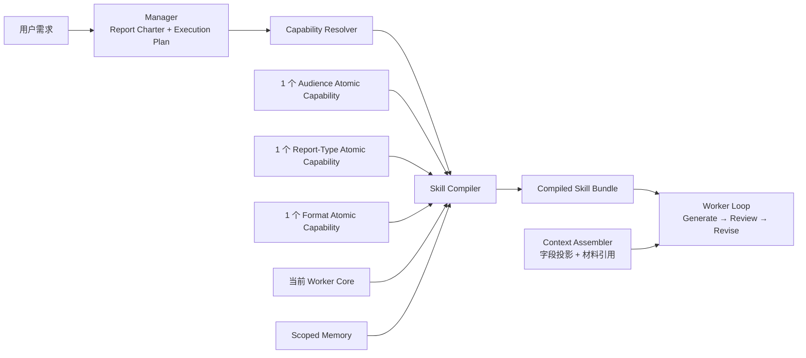

# 可组合原子 Skills 架构方案

> 状态：P0-P8 已落地；6 个 Worker 已启用 capability、projected context 与 scoped memory；真实模型盲评和真实 run token 采样待持续执行
> 目标：将当前 Manager + 6 Worker 架构中的场景规则拆成可组合原子能力，在保持 Worker 专业边界和 schema 稳定的前提下，降低单次执行上下文、重复规则与维护成本。
> 关联：`README.md` 第八章 TODO、`configs/agents.json`、`presentation_agent/skill_package.py`
> 实施拆分：`docs/atomic_skills_implementation_plan.md`

## 1. 结论先行

建议保留现有 6 个 Worker，不把它们扩张成 45 个“场景 Worker”，也不把所有 Worker 打散为由 Manager 自由拼接的微步骤。

目标结构应是：

```text
Worker = 稳定的专业执行容器
本轮 Skill Bundle =
  1 个环节核心能力
  + 1 个受众能力
  + 1 个汇报性质能力
  + 1 个材料格式能力
  + 本轮命中的少量 memory
```

对应的原子能力数量是：

- 6 个环节核心能力；
- 5 个受众能力；
- 3 个汇报性质能力；
- 3 个材料格式能力。

即 **17 个可复用能力包，而不是 5 × 3 × 3 × 6 = 270 份场景化 Skill**。Manager 只定义任务维度和是否需要某个 Worker，runtime 负责确定性解析与编译，避免 Manager 临场拼 prompt。

这次改造还应同时处理输入上下文。当前 `WorkerExecutor.create_task()` 会将选中的上游 artifact 整体合并进 `worker_input`；即使 Skill 已拆薄，完整 artifact 继续逐阶段累积，仍会造成上下文膨胀。因此方案必须包含两条并行主线：

1. **Skill 原子化**：只加载本轮相关规则；
2. **Context 投影**：只给 Worker 它真正需要的上游字段和材料引用。



## 2. 当前架构诊断

### 2.1 已有设计中值得保留的部分

当前系统的骨架是成立的：

- Manager 已经拥有任务定义、规划、派发、验收和返工权；
- 6 个 Worker 有清晰的专业产物和输入输出 schema；
- Worker loop 已实现生成、review、P0 返工和 human gate；
- Skill、rubrics、schema 已从 Python runtime 中分离；
- memory 已采用“少量生成前召回 + review 全量扫描”的轻记忆原则；
- task directory 和 Manager task packet 已经为上下文隔离打好基础。

因此这次不需要推翻 Manager / Worker 架构，只需把“一个 Worker 对应一个大 Skill 包”升级为“一个 Worker 对应一个动态编译的 Skill Bundle”。

### 2.2 当前 Skill 的主要问题

#### 问题一：专业 SOP 与三个场景维度混写

例如 `skills/argument_synthesis/SKILL.md` 同时包含：

- 论点提炼的稳定流程；
- `board / exec_office / strategy_lead / business_team / external` 的受众适配；
- `deep_dive / quick_sync` 的深度适配；
- `document / ppt / html` 的载体适配。

其余 Worker 也存在相似重复。这使同一批受众、性质和格式规则散落在多个 Skill 和 rubric 中，修改一条“董事会规则”可能需要同步修改 6 个目录。

#### 问题二：未命中的场景规则仍进入上下文

`presentation_agent/skill_package.py` 当前按 `agent_id` 读取完整 `SKILL.md`；`GenericSkill` 再把整份说明书放入 system prompt。一次董事会 PPT 任务，也会携带外部分享、HTML、文档等无关规则。

当前 6 个 Worker 的 `SKILL.md + rubrics.json` 维护面合计约 205 KB；其中 `format` 单包约 41 KB，并同时描述 PPT、DOCX、HTML 三套 harness。虽然生成和 review 不会在同一 prompt 中加载全部内容，但每轮仍加载了大量与当前场景无关的切片。

#### 问题三：格式能力不是普通“语气修饰”

PPT、文档、HTML 不仅措辞不同，还涉及：

- 不同信息结构；
- 不同输出 schema；
- 不同 renderer 和工具权限；
- 不同 QA 方法；
- 不同后续讲述粒度。

因此材料格式不能只做成三段附加提示；它应是可选择的执行能力包，尤其 `format` Worker 必须只加载一个具体实现。

#### 问题四：缺少“业务进展汇报”这一独立性质

当前正式枚举主要是 `deep_dive` 与 `quick_sync`。业务进展汇报既不是深度专题，也不是简单信息同步，它有稳定结构：

```text
目标/承诺 → 当前进展 → 偏差与原因 → 风险/卡点 → 决策或支持请求 → 下一步
```

建议新增 `business_progress`，不要把它继续挤进 `quick_sync`。

#### 问题五：上游 artifact 以整包合并方式传递

`presentation_agent/manager.py` 当前会对 task packet 中的每个 `input_artifact` 执行整体读取并 `worker_input.update(data)`。这有三类风险：

- 后段 Worker 继承过多历史字段；
- 多个 artifact 顶层字段可能互相覆盖；
- Worker 难以分辨字段来自哪个正式产物。

这是与 Skill 体积并列的上下文成本来源。

## 3. 设计原则

### 3.1 Worker 与 Skill 解耦

Worker 表示“谁对哪类专业产物负责”，Skill 表示“本次任务需要采用哪些工作方法和判断规则”。

因此：

- Worker 数量不随场景组合增长；
- Worker 的输入输出边界保持稳定；
- Skill Bundle 可随任务动态变化；
- 同一个受众能力可被多个 Worker 复用。

### 3.2 三个维度正交

三个维度各自拥有不同规则域，尽量避免互相覆盖：

| 维度 | 主要拥有的规则 |
|---|---|
| 汇报对象 | 决策视角、关切点、语气、可接受细节、典型追问 |
| 汇报性质 | 分析深度、篇幅节奏、证据完备度、信息更新结构 |
| 材料格式 | 信息结构、表达形态、输出契约、工具、渲染和 QA |

核心 Worker 拥有专业流程、角色边界和交接契约，不再重复定义上述场景规则。

### 3.3 组合必须确定性

Manager 输出标准化的 `report_charter`，runtime 根据 charter 解析能力，不允许模型自由写入任意 Skill 路径或临时拼接规则。

```text
Manager 负责：这是什么任务
Resolver 负责：需要哪些能力
Compiler 负责：这些能力怎样形成最小可执行包
Worker 负责：执行
```

### 3.4 先保持 schema 稳定

第一阶段不为 45 种场景分别设计 schema。建议：

- `argument_synthesis / storyline_design / page_filling / qa_preparation / speaker_script` 沿用各自统一 schema；
- 受众和汇报性质只改变 SOP 与 rubrics；
- 只有 `format` Worker 根据 `ppt / document / html` 选择具体输出 schema 和工具。

这样能把改造风险集中在装配层，而不是同时重做所有上下游契约。

### 3.5 显式约束高于默认规则，memory 永远是软约束

同一属性的优先级建议固定为：

```text
用户/项目显式约束
  > 当前原子能力的规则
  > Worker 核心默认值
  > memory 建议
```

例如用户明确要求董事会材料 20 页，不能因为 `audience.board` 的默认页数偏好而强行改成 10 页；应保留 20 页约束，并在 planning 时提示高层阅读风险。

## 4. 目标能力模型

### 4.1 六个环节核心能力

| capability_id | 稳定职责 |
|---|---|
| `core.argument_synthesis` | 决策问题、核心论点、证据链、反方与边界 |
| `core.storyline_design` | story arc、标题体系、页面/模块顺序、附录切分 |
| `core.page_filling` | 单元内容、证据放置、图表 brief、来源与缺口 |
| `core.format` | 载体交付的稳定边界与通用检查；具体实现由 `format.*` 能力提供 |
| `core.qa_preparation` | 会场压力测试、可答性分类、补证与防守计划 |
| `core.speaker_script` | 口头讲法、节奏、转场、风险桥接与排练 |

核心能力只保留：

- Role / boundary；
- 输入就绪检查；
- 稳定 workflow；
- 通用 hard constraints；
- 输入输出契约；
- 与 memory 的接口。

### 4.2 五个受众能力

| capability_id | 核心关注 |
|---|---|
| `audience.board` | 重大取舍、风险收益、替代方案、授权边界 |
| `audience.exec_office` | 跨部门协调、卡点、责任关系、待拍板事项 |
| `audience.strategy_lead` | 分析框架、关键假设、反方、验证路径 |
| `audience.business_team` | 业务动作、指标、owner、节奏与落地依赖 |
| `audience.external` | 公开表达、行业价值、术语解释、敏感信息过滤 |

一个受众包内部可以有面向不同 Worker 的小切片，但仍由同一目录维护。例如 `audience.board` 对：

- argument：要求结论体现重大取舍；
- storyline：要求首尾围绕决策；
- page：减少运营细节；
- Q&A：强化 downside 和替代方案；
- script：先结论后解释。

runtime 只提取当前 Worker 对应切片，不加载整个受众包。

### 4.3 三个汇报性质能力

| capability_id | 推荐结构 |
|---|---|
| `report.deep_dive` | 问题定义 → 多候选判断 → 完整证据链 → 反方/边界 → 决策建议 |
| `report.business_progress` | 目标/承诺 → 进展 → 偏差 → 风险/卡点 → 支持请求 → 下一步 |
| `report.quick_sync` | 一句话变化 → 影响 → 是否需要动作 → 后续观察点 |

该维度主要控制：

- 是否需要多候选；
- 证据与反方深度；
- 主线长度；
- Q&A 范围；
- 讲述时长；
- 哪些 Worker 可以跳过。

### 4.4 三个材料格式能力

| capability_id | 主要能力 |
|---|---|
| `format.ppt` | 页级信息结构、图表、版式、PPT renderer、逐页 QA |
| `format.document` | 章节结构、段落/表格/脚注、DOCX renderer、分页 QA |
| `format.html` | 首屏、导航、模块展开、交互状态、HTML renderer、浏览器 QA |

其中 `core.format + format.*` 共同组成当前 `format` Worker 的具体实现：

```text
format Worker
  + format.ppt       → PPT composer
  + format.document  → Document composer
  + format.html      → HTML composer
```

这样无需新增三个长期 Worker，但运行时只加载一种格式的 SOP、schema、工具与 QA 规则。

## 5. 能力包目录与契约

建议目录：

```text
skills/
├── core/
│   ├── argument_synthesis/
│   ├── storyline_design/
│   ├── page_filling/
│   ├── format/
│   ├── qa_preparation/
│   └── speaker_script/
└── atomic/
    ├── audience/
    │   ├── board/
    │   ├── exec_office/
    │   ├── strategy_lead/
    │   ├── business_team/
    │   └── external/
    ├── report_type/
    │   ├── deep_dive/
    │   ├── business_progress/
    │   └── quick_sync/
    └── format/
        ├── ppt/
        ├── document/
        └── html/
```

每个原子能力包建议包含：

```text
<capability>/
├── SKILL.md                 # 简短说明、设计意图和通用规则
├── manifest.json            # runtime 可确定性解析的元数据
├── rules.json               # 可按 Worker / 生成 / review 过滤的规则
├── rubrics.json             # 本能力拥有的审查标准
├── schemas/                 # 仅在能力真正拥有 schema 时存在
├── references/              # 示例、风格说明，按需读取
└── tools.json               # 仅格式能力等需要工具声明时存在
```

`manifest.json` 的建议结构：

```json
{
  "id": "audience.board",
  "version": "1.0.0",
  "kind": "audience",
  "select_when": {"audience": "board"},
  "applies_to": [
    "argument_synthesis",
    "storyline_design",
    "page_filling",
    "format",
    "qa_preparation",
    "speaker_script"
  ],
  "owns": ["decision_lens", "detail_level", "tone", "question_lens"],
  "incompatible_with": [],
  "prompt_budget_tokens": 450
}
```

`rules.json` 中每条规则应可过滤：

```json
{
  "id": "AUD-BOARD-SL-001",
  "applies_to": ["storyline_design"],
  "phase": ["generation", "review"],
  "level": "P1",
  "property": "detail_level",
  "instruction": "主线只保留影响重大取舍的证据，运营细节移入附录。",
  "check": "主线页面是否出现无法改变董事会判断的运营细节。"
}
```

这样“董事会规则”只有一个事实源，但 runtime 不会在 argument Worker 中加载 Q&A 或讲稿切片。

## 6. Skill Resolver 与 Compiler

### 6.1 Report Charter 标准化

`report_charter` 建议使用稳定枚举：

```json
{
  "audience": {
    "primary": "board",
    "secondary": [],
    "notes": ""
  },
  "report_type": "deep_dive",
  "output_format": "ppt",
  "decision_goal": "",
  "expected_action": "",
  "explicit_constraints": {}
}
```

V1 建议每个维度只允许一个主值。若存在混合受众，选择一个 primary，其他要求进入 `secondary` 和项目约束；不要同时完整加载两个受众包。

### 6.2 确定性解析

新增 `CapabilityResolver`：

```text
resolve(worker_id, report_charter)
  → core.<worker>
  → audience.<primary>
  → report.<report_type>
  → format.<output_format>
```

Manager 只输出 charter 枚举和 task plan，不直接指定文件路径。Resolver 负责：

- 校验三个维度是否完整；
- 拒绝未知能力；
- 检查 incompatibility；
- 过滤不适用于当前 Worker 的规则；
- 选择 format Worker 的具体 schema 与 tools。

### 6.3 编译为现有 SkillPackage 接口

新增 `SkillCompiler`，输出一个与现有 `SkillPackage` 兼容的 `CompiledSkillPackage`：

```json
{
  "agent_id": "storyline_design",
  "selected_capabilities": [
    "core.storyline_design",
    "audience.board",
    "report.deep_dive",
    "format.ppt"
  ],
  "instructions": "...仅包含四个能力对 storyline 有效的切片...",
  "rubrics": [],
  "schemas": {},
  "tools": [],
  "context_requirements": [],
  "fingerprint": "..."
}
```

这样 `GenericSkill`、`ArtifactReviewer` 和 Worker loop 初期都不必大改，只需把 `load_skill_package(root, agent_id)` 替换为：

```text
compile_skill_package(root, spec, report_charter)
```

每次编译结果写入 run 目录：

```text
runs/<run_id>/tasks/<task_id>/compiled_skill_manifest.json
```

它记录选择结果、版本、规则 ID、schema、工具和 fingerprint，便于复现“这次为什么这样生成和审查”。

## 7. Context 投影：与 Skill 原子化同时实施

### 7.1 不再平铺合并 artifact

建议把 Worker 输入改成带来源的结构：

```json
{
  "report_charter": {},
  "manager_task": {},
  "inputs": {
    "argument_synthesis": {
      "artifact_path": "...",
      "inline_fields": {}
    },
    "storyline": {
      "artifact_path": "...",
      "inline_fields": {}
    }
  },
  "material_refs": []
}
```

避免 `worker_input.update(data)`，也避免不同 artifact 顶层字段覆盖。

### 7.2 每个核心能力声明输入视图

在 core capability 的 `manifest.json` 中声明必要字段：

```json
{
  "context_requirements": [
    "report_charter.audience",
    "report_charter.decision_goal",
    "artifact:argument_synthesis.executive_summary",
    "artifact:argument_synthesis.key_arguments",
    "artifact:argument_synthesis.evidence_bank"
  ]
}
```

新增 `ContextAssembler`：

- 小字段直接 inline；
- 大型 evidence、原始表格和历史材料保留为路径 + 摘要 + 索引；
- Worker 需要细节时再读取指定引用；
- review 只读取 rubric 所需的信号视图，不重复携带完整上游材料。

### 7.3 目标上下文预算

建议先设软预算并记录，不立即硬截断：

| 区块 | 建议目标 |
|---|---|
| 编译后 generation instructions | ≤ 4,000 tokens |
| 单次 review rubrics | ≤ 3,000 tokens |
| memory | ≤ 6 条，≤ 600 tokens |
| report charter + task packet | ≤ 1,000 tokens |
| 上游结构化摘要 | 按 Worker 配额记录，超限告警 |

rubric 的长 `fail_examples` 可移入 `references/`；常规 review prompt 只保留 `criterion / check / fix`。机器可判定规则继续由 machine check 执行，不进入 LLM review。

## 8. Manager 与动态执行计划

Manager 的 `available_workers` 仍只展示 6 个专业 Worker，避免让 Manager 在 17 个能力包之间自由发挥。

Manager planning 新增两项职责：

1. 将用户需求归一为三个标准维度；
2. 判断哪些 Worker 是必要任务。

建议的默认路线：

| 汇报性质 | 默认 Worker 路线 |
|---|---|
| `deep_dive` | argument → storyline → page → format；高层场景默认增加 Q&A，speaker 按用户需要 |
| `business_progress` | argument → storyline → page → format；Q&A 根据风险和受众决定 |
| `quick_sync` | argument → storyline → page → format，但各 Worker 使用精简模式；Q&A / speaker 默认跳过 |

V1 暂不为 quick sync 建立跨 schema 的“超级捷径”。先依靠原子能力压缩每个 Worker 的工作量和上下文，等评测证明仍有明显延迟，再考虑 `argument → format` 的短路径。

Manager 的 task packet 可增加只读字段：

```json
{
  "capability_selection": {
    "audience": "board",
    "report_type": "deep_dive",
    "output_format": "ppt"
  }
}
```

runtime 必须与 `report_charter` 交叉校验，不能信任模型提供的任意能力 ID。

## 9. Memory 的适配

当前 memory 主要按 Worker 归属；原子能力化后，不建议为 45 个组合建立 memory 库。

建议每条 memory 增加适用范围：

```json
{
  "owner": "audience.board",
  "applies_to": {
    "worker": ["storyline_design"],
    "audience": ["board"],
    "report_type": ["*"],
    "format": ["*"]
  },
  "dimension": "detail_level",
  "trigger": "...",
  "suggestion": "..."
}
```

反馈归因示例：

| 反馈 | 推荐 owner |
|---|---|
| “核心论点没有证据闭环” | `core.argument_synthesis` |
| “董事会材料不要铺运营细节” | `audience.board` |
| “进展汇报必须说清偏差和 owner” | `report.business_progress` |
| “PPT 一页字太多，复杂关系要图形化” | `format.ppt` |
| “董事会快速同步只需要三页” | 暂存为带交叉 scope 的 memory，不立即晋升通用 rubric |

检索时先做 scope compatibility，再按相关性取 top-k。晋升目标由 owner 决定：

- core memory → 对应 Worker rubric；
- audience memory → 对应 audience rubric；
- report memory → 对应 report-type rubric；
- format memory → 对应 format rubric；
- 过度依赖多个维度的交叉经验继续留在 memory，不急于固化。

## 10. Rubrics 与 Review 的组合

本轮 review rubric 应与 generation 使用同一个 compiled manifest，防止“生成时按一套规则，审查时按另一套规则”。

组合顺序：

```text
core rubrics
  + 当前 Worker 适用的 audience rubrics
  + 当前 Worker 适用的 report-type rubrics
  + 当前 Worker 适用的 format rubrics
  + scope 匹配的 promoted memory rubrics
```

要求：

- rubric ID 全局唯一并带 namespace；
- 同一 `property` 出现两个 P0 且结论冲突时，Compiler 直接失败；
- machine-check rubric 先执行并从 LLM prompt 中剔除；
- reviewer 不读取未命中场景的 rubrics；
- examples 放 reference，不默认进入 prompt。

## 11. 需要修改的主要模块

| 文件/模块 | 设计变化 |
|---|---|
| `configs/agents.json` | 保留 Worker；增加 capability 配置、`business_progress` 枚举与 format schema 映射 |
| `presentation_agent/models.py` | 增加 `CapabilitySpec / CapabilitySelection / CompiledSkillPackage` |
| `presentation_agent/skill_package.py` | 从单包加载器升级为 resolver + compiler，保留兼容入口 |
| `presentation_agent/manager.py` | charter 标准化；task input 改为带来源的 context manifest，不再平铺合并 |
| `presentation_agent/skills/generic.py` | 读取 compiled package；记录 prompt budget 和 capability fingerprint |
| `presentation_agent/review.py` | 使用同一 compiled rubric 集；支持 compact rubric |
| `presentation_agent/memory_router.py` | 从“路由到 Worker”升级为“路由到 core/audience/report/format owner” |
| `presentation_agent/memory_retrieval.py` | 先过滤 capability scope，再做相关性排序 |
| `presentation_agent/routing.py` | 删除硬编码的董事会/format 动作，改由 capability rules 提供 |

`GenericSkill` 本身应尽量保持通用，不在 Python 中重新硬编码 board、PPT 或 quick sync 规则。

## 12. 分阶段迁移方案

### Phase 0：建立基线

- 记录当前 6 个 Worker 的 generation/review prompt 大小；
- 固定 3 个代表性案例及人工质量基线；
- 为现有 Skill 和 rubric 生成规则清单，识别重复项与冲突项。

### Phase 1：标准化三个维度

- 保留现有 `deep_dive` 枚举，对用户展示名称统一为“深度分析”；
- 新增 `business_progress`；
- 统一 `material_format` 与 `output_format` 命名；
- 扩展 `report_charter`，不改变现有 Skill 执行。

### Phase 2：引入 Compiler，保持旧包兼容

- 新增 capability manifest、resolver、compiler；
- 先提取 audience / report-type / format 的适配段；
- 编译结果仍输出旧 `SkillPackage` 接口；
- 使用 feature flag 在旧包与 compiled bundle 之间切换。

### Phase 3：拆分 format 实现

- 将 `skills/format` 中 PPT、DOCX、HTML 三套 harness 分入三个 format capability；
- format Worker 根据选择加载一个具体 schema、renderer 和 QA；
- 保留统一的 artifact manifest，避免下游依赖 renderer 内部细节。

### Phase 4：实施 ContextAssembler

- 停止整体 `update()` 上游 artifact；
- 为每个 core capability 声明 context requirements；
- 对大型 evidence/material 使用引用和摘要；
- 增加 prompt/context budget 日志。

### Phase 5：迁移 memory 与 promotion

- memory 增加 owner 和 scope；
- 更新反馈路由；
- promotion 能写入 core/atomic 对应 rubric；
- 对旧 memory 默认映射到原 Worker core，避免丢失历史。

### Phase 6：评测后切换默认

- 完成编译测试、端到端质量对比和 token 对比；
- 达到门槛后默认启用 compiled bundle；
- 旧 `skills/<agent_id>` 保留一个版本周期作为 fallback，再删除重复适配规则。

## 13. 验收与评测

### 13.1 确定性测试

- 任意合法 charter 必须解析出且只解析出一个 audience、report type、format；
- 45 种三维组合 × 6 个 Worker 均能完成 bundle 编译；
- 编译结果不包含未命中场景关键词，例如 board + PPT 不应包含 external / HTML 的规则；
- rubric ID 无重复；
- schema 与 tool 选择唯一；
- 同一输入和版本的 fingerprint 稳定；
- scoped memory 不会跨 audience / format 污染。

### 13.2 三个端到端代表案例

1. 董事会 × 深度分析 × PPT；
2. 业务团队 × 业务进展 × 文档；
3. 外部分享 × 快速同步 × HTML。

每个案例比较旧架构与新架构：

- 最终材料质量；
- 关键结论与证据完整度；
- 受众适配；
- 格式适配；
- generation/review token；
- 返工轮数；
- 总耗时。

### 13.3 建议门槛

- 静态 Skill / rubric prompt 至少下降 40%；
- 端到端总 token 至少下降 25%；
- schema 合规率不得下降；
- 人工盲评质量不低于旧架构；
- 三个代表场景均无跨场景规则污染。

## 14. 明确不建议的方案

### 不建立 45 或 270 份完整 Skill

这会把上下文问题变成版本管理问题，同一条规则需要在大量组合中同步。

### 不让 Manager 自由拼接自然语言 Skill

Manager 可以决定任务，但不应成为 prompt 编译器。组合必须由 runtime 根据 manifest 确定性完成。

### 不为每个三维组合建立独立 schema 或 memory

schema 应围绕专业产物稳定，memory 应通过 scope 表达交叉适用范围。组合级实体只存在于一次 run 的 compiled manifest 中。

### 不把 6 个 Worker 合并为一个“万能执行 Agent”

Worker 的专业边界、独立上下文和 maker-checker 隔离正是当前架构的价值。应拆 Skill，不应重新制造单一巨型上下文。

## 15. 推荐的最小可行落点

第一轮只做以下闭环即可验证价值：

1. 选择 `storyline_design` 作为样板 Worker；
2. 提取 5 个 audience、3 个 report type、3 个 format 中与 storyline 有关的规则；
3. 实现 `CapabilityResolver + SkillCompiler`；
4. 保持 `storyline.v1` schema 不变；
5. 增加 compiled manifest 和 prompt budget；
6. 用三个代表案例做旧/新盲评。

若样板验证成立，再迁移 argument、page、Q&A、speaker；最后拆 format，因为它涉及 renderer、schema 和视觉 QA，改造收益大但风险也最高。

这一演进顺序能先验证“原子规则是否真的减少上下文且不损伤质量”，再处理最复杂的格式执行层。
