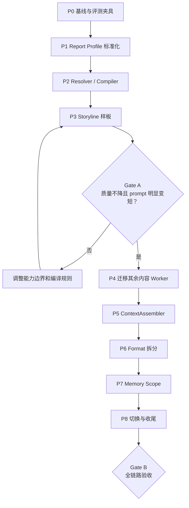

# 可组合原子 Skills 实施计划

> 状态：P0-P8 已完成；可自动化 Gate B 项已通过，真实模型盲评与真实 run token Gate 待执行
> 上游设计：`docs/atomic_composable_skills_architecture.md`
> 实施原则：小步迁移、旧链路可回退、先纵向验证一个 Worker，再横向铺开。

## 1. 总体拆分

当前进度：

- [x] P0 基线与 prompt budget；
- [x] P1 Report Profile 标准化并加入 `business_progress`；
- [x] P2 Resolver / Compiler 与 legacy fallback；
- [x] P3 Storyline 纵向样板；
- [x] 静态 Gate A：generation instruction 缩短约 41%，review rubric 缩短约 71%-73%；
- [x] P4：其余 4 个内容 Worker 已迁移，generation instruction 缩短约 42%-78%，review rubric 缩短约 69%-84%；
- [x] P5 核心链路：namespaced context、字段投影、大字段预览/引用、context manifest 与 reviewer 上游信号；
- [x] P6：Format 拆为 PPT / document / HTML 三种执行能力，renderer 与 capability 交叉校验；
- [x] P7：memory owner/scope 过滤、反馈路由与 atomic rubric promotion；
- [x] P8：Manager/Web/Host Skill、可观测性与默认切换；
- [x] 270 种 Worker/profile bundle 组合编译通过；
- [x] PPT、DOCX、HTML renderer smoke tests 通过；
- [x] 离线回归：155 tests passed，2 个真实 CLI integration tests 按环境变量显式启用；
- [ ] 三个代表案例的真实模型旧/新盲评；
- [ ] P5 端到端 token 降幅验收；

建议把改造拆成 9 个可独立合并的阶段：

```text
P0 基线与评测夹具
  ↓
P1 Report Profile 标准化
  ↓
P2 Capability Resolver / Compiler
  ↓
P3 Storyline 纵向样板
  ↓ Gate A：验证上下文与质量收益
P4 迁移其余内容 Worker
  ↓
P5 ContextAssembler
  ↓
P6 Format 三能力拆分
  ↓
P7 Memory scope / promotion
  ↓
P8 Manager、Web、文档与默认切换
  ↓ Gate B：全链路验收
```



推荐按阶段分别提交，不做一个覆盖 runtime、skills、memory、format 的大提交。P3 是最重要的决策门：如果原子组合没有带来足够的 prompt 降幅或质量稳定性，就先调整模型，不继续批量迁移。

## 2. 实施时采用的四个默认决策

这些决定可以显著降低第一轮改造风险。

### 2.1 暂不搬动现有 6 个 Worker Skill 目录

第一轮保留：

```text
skills/argument_synthesis/
skills/storyline_design/
skills/page_filling/
skills/format/
skills/qa_preparation/
skills/speaker_script/
```

将它们逐步收缩为 core skill；新增：

```text
skills/atomic/audience/*
skills/atomic/report_type/*
skills/atomic/format/*
```

这样 `configs/agents.json`、schema 路径、旧 run 和 Web 文件浏览都不会立即失效。是否最终整理为 `skills/core/*`，放到全部迁移稳定后再决定。

### 2.2 Report Charter v1 做向后兼容扩展

第一轮不把 `audience` 从字符串改为对象，也不升级所有 schema 版本。保留：

```json
{
  "audience": "board",
  "report_type": "deep_dive",
  "output_format": "ppt"
}
```

新增可选字段：

```json
{
  "secondary_audiences": [],
  "audience_notes": "",
  "report_profile_version": "v1"
}
```

这样现有输入、examples 和旧测试仍可工作。

### 2.3 Format 第一轮只拆 SOP / rubric / tool，不立即拆 schema

先继续使用 `formatted_material.v1`，验证 PPT、document、HTML 只加载各自规则。只有当统一 schema 明显限制 renderer 或 QA 时，再单独设计：

- `ppt_material.v1`
- `document_material.v1`
- `html_material.v1`

不要在 Skill 原子化的同时重写全部下游契约。

### 2.4 Memory 先加 scope，不立即迁移物理目录

继续保留：

```text
data/agents/<agent_id>/memory.json
data/agents/<agent_id>/learning_log.jsonl
```

给 `MemoryItem` 增加 `owner` 和 `applies_to`。这样历史 memory 无需搬迁，读取旧条目时自动补默认 scope。

## 3. 总修改面

| 模块 | 主要文件 | 修改性质 |
|---|---|---|
| 配置与枚举 | `configs/agents.json`、新增 `configs/capabilities.json` | 定义合法 profile、atomic capability 注册表、feature flag |
| Manager 契约 | `skills/manager/SKILL.md`、`skills/manager/schemas/report_charter.v1.json`、`task_packet.v1.json` | 增加业务进展汇报和 profile 归一规则 |
| Capability runtime | `presentation_agent/skill_package.py`、新增 `presentation_agent/capabilities/*` | 解析、组合、冲突检查、fingerprint |
| Worker runtime | `presentation_agent/loop.py`、`presentation_agent/step.py`、`presentation_agent/skills/generic.py` | 按本轮 profile 编译 Skill，并确保 revise/review 使用同一版本 |
| 输入上下文 | `presentation_agent/manager.py`、`presentation_agent/input_loader.py`、新增 context assembler | artifact 命名空间化与字段投影 |
| Review | `presentation_agent/review.py`、`presentation_agent/machine_check.py` | 使用 compiled rubrics，缩短 LLM rubric |
| Format | `skills/format/*`、`presentation_agent/renderers/*`、`presentation_agent/step.py` | 三类载体只加载自己的 SOP、rubric 和 QA |
| Memory | `presentation_agent/memory.py`、`memory_router.py`、`memory_retrieval.py` | scope 过滤、能力 owner、定向 promotion |
| 入口与兼容 | `presentation_agent/launch.py`、`pipeline.py`、`routing.py` | profile 默认值、旧流水线兼容、移除硬编码场景规则 |
| Web / CLI | `presentation_agent/web.py`、`web_static/*`、`cli.py` | 展示 active capabilities、compiled manifest、scoped memory |
| Host skill | `skills/report_builder/SKILL.md`、`.claude/agents/*`、`.codex/prompts/*` | 在默认切换后更新说明，不提前复制内部逻辑 |
| 测试 | `tests/*`、新增 fixtures/evals | 编译矩阵、隔离、兼容、端到端质量与 token |

## 4. P0：建立基线与评测夹具

### 目标

在改代码前固定“现在的质量、prompt 大小和行为”，否则改造后无法判断是优化还是单纯变短。

### 新增

```text
tests/fixtures/capability_cases/
├── board_deep_dive_ppt/
├── business_progress_document/
└── external_quick_sync_html/

scripts/measure_prompt_budget.py
tests/test_prompt_budget.py
```

### 修改

- `presentation_agent/skills/generic.py`
  - 为 generation request 记录 system/user/schema 的字符数和估算 token。
- `presentation_agent/review.py`
  - 为 review request 记录 rubric/artifact/upstream signal 的体积。
- `presentation_agent/step.py`、`loop.py`
  - 将预算摘要写入 `run_state.json` 或独立 `prompt_budget.json`。

### 三个固定案例

1. `board × deep_dive × ppt`
2. `business_team × business_progress × document`
3. `external × quick_sync × html`

第二个案例在旧链路中可暂用最接近的模式运行，但 fixture 必须明确期望的“目标/进展/偏差/风险/请求/下一步”结构。

### 完成标准

- 可以输出每个 Worker 的 generation/review prompt 体积；
- 三个案例的输入、期望结构和人工审查要点固定；
- 当前主测试套件通过；
- 本阶段不改变任何生成行为。

### 回滚

删除指标记录代码即可，不影响 artifact 契约。

## 5. P1：标准化 Report Profile

### 目标

建立 Resolver 可依赖的稳定三维枚举，并补上 `business_progress`。

### 新增

`configs/capabilities.json`：

```json
{
  "version": "capability-registry.v1",
  "runtime": {
    "enabled": false,
    "pilot_agents": []
  },
  "dimensions": {
    "audience": [
      "board",
      "exec_office",
      "strategy_lead",
      "business_team",
      "external"
    ],
    "report_type": [
      "deep_dive",
      "business_progress",
      "quick_sync"
    ],
    "output_format": [
      "document",
      "ppt",
      "html"
    ]
  },
  "aliases": {}
}
```

### 修改

- `skills/manager/schemas/report_charter.v1.json`
  - 为 `audience / report_type / output_format` 增加 enum；
  - 增加可选 `secondary_audiences / audience_notes / report_profile_version`。
- `skills/manager/SKILL.md`
  - planning 阶段负责归一 profile；
  - 明确业务进展汇报与 quick sync 的边界。
- `presentation_agent/launch.py`
  - 接受 `business_progress`；
  - 统一默认和 alias；
  - 对未知枚举给出明确错误，而不是静默接受。
- `configs/agents.json`
  - 保留 Worker 定义；
  - 删除或标记与新 registry 重复的场景枚举；
  - 增加 capability runtime 配置引用。
- `presentation_agent/routing.py`
  - 同时兼容 `output_format` 与旧 `material_format`；
  - 暂不移除原有动作，等 P3 验证后再迁移。

### 测试

新增 `tests/test_report_profile.py`，覆盖：

- 三个维度的全部合法值；
- 常见中文 alias 到标准值；
- `business_progress` 不被归为 `quick_sync`；
- 未知值失败；
- 旧 raw brief 仍可 normalize。

同步更新：

- `tests/test_launch.py`
- `tests/test_manager.py`
- `tests/test_state.py`
- `examples/raw_brief.json`

### 完成标准

- Manager 和直接 launch 两条入口产生同样的标准三维值；
- 旧 `deep_dive / quick_sync` 输入兼容；
- feature flag 仍为关闭，运行行为不变。

### 回滚

关闭 registry 校验并恢复 schema 的自由字符串即可。

## 6. P2：实现 Capability Resolver / Compiler

### 目标

建立原子能力组合机制，但先不迁移任何 Worker 内容。

### 新增模块

```text
presentation_agent/capabilities/
├── __init__.py
├── models.py
├── registry.py
├── resolver.py
├── compiler.py
└── budget.py
```

建议职责：

| 文件 | 职责 |
|---|---|
| `models.py` | `CapabilitySpec`、`CapabilitySelection`、`CompiledSkillPackage` |
| `registry.py` | 加载 `configs/capabilities.json` 和 atomic capability manifest |
| `resolver.py` | 根据 Worker + report profile 选择 core/audience/report/format |
| `compiler.py` | 过滤规则、合并 instructions/rubrics/schema/tools、检查冲突 |
| `budget.py` | 计算各区块预算并产生告警 |

### 修改 `presentation_agent/skill_package.py`

- 保留 `load_skill_package(root, agent_id)`，作为 legacy loader；
- 新增：

```python
compile_skill_package(
    root,
    spec,
    report_profile,
    *,
    legacy_fallback=True,
) -> CompiledSkillPackage
```

- `CompiledSkillPackage` 继续提供：
  - `instructions`
  - `rubrics`
  - `schemas`
  - `to_dict()`
- 新增：
  - `selected_capabilities`
  - `tools`
  - `context_requirements`
  - `fingerprint`
  - `budget`

### 修改 Worker runtime

#### `presentation_agent/loop.py`

它已经先读取 `input_data`，再加载 SkillPackage，改造相对直接：

1. 从 input/report charter 提取 profile；
2. 调用 compiler；
3. 将 compiled manifest 写入 run 目录；
4. generation、review、revise 全程复用同一对象。

#### `presentation_agent/step.py`

当前在 `StepRunner.__init__()` 中过早执行 `load_skill_package()`，此时尚未读取 task input。需要改为：

1. `__init__()` 只加载 `AgentSpec`；
2. 第一次 `prepare()` 时读取 input 和 profile；
3. 编译 SkillPackage；
4. 将 selection/fingerprint 写入 `run_state.json`；
5. review/revise 时按 fingerprint 重新加载或读取缓存，禁止中途漂移。

Manager Skill 继续使用 legacy `load_skill_package(root, "manager")`，不参与 atomic capability 编译。

### 组合与冲突规则

- 每个 Worker 必须恰好有 1 个 core；
- 每个维度必须恰好选中 1 个 atomic capability；
- 只合并 `applies_to` 包含当前 Worker 的规则；
- rubric ID 必须唯一；
- 同一 `property` 出现相互冲突的 P0 时编译失败；
- 显式项目约束不写入 Skill，由 task/context 单独传入；
- memory 不在 compiler 内读取，只在 runtime 后续注入。

### 新增测试

```text
tests/test_capability_registry.py
tests/test_capability_resolver.py
tests/test_skill_compiler.py
```

关键用例：

- 45 个 profile × 6 个 Worker 共 270 次编译全部成功；
- 同一输入得到稳定 fingerprint；
- 非当前 Worker 的规则不会进入 bundle；
- 冲突 P0 会失败；
- feature flag 关闭时返回 legacy package；
- manager/task_positioning 始终走 legacy。

### 完成标准

- 空 atomic capability 或等价 atomic capability 下，compiled package 与 legacy 行为一致；
- runtime 可记录 compiled manifest；
- 所有现有测试保持通过；
- 仍未修改实际 Skill 内容。

### 回滚

将 `configs/capabilities.json.runtime.enabled` 设为 `false`，立即回到 legacy loader。

## 7. P3：Storyline 纵向样板

### 目标

只迁移 `storyline_design`，验证完整链路：

```text
profile → resolve → compile → generation → review → revise → manifest → budget
```

### 新增 11 个 atomic capability 包

```text
skills/atomic/
├── audience/
│   ├── board/
│   ├── exec_office/
│   ├── strategy_lead/
│   ├── business_team/
│   └── external/
├── report_type/
│   ├── deep_dive/
│   ├── business_progress/
│   └── quick_sync/
└── format/
    ├── document/
    ├── ppt/
    └── html/
```

每个包至少包含：

```text
SKILL.md
manifest.json
rules.json
rubrics.json
```

第一轮 `applies_to` 只声明 `storyline_design`，避免看起来已经支持所有 Worker。

### 修改 `skills/storyline_design`

从 `SKILL.md` 中移出：

- Audience Adaptation；
- Report Type Adaptation；
- Format Adaptation。

保留：

- role boundary；
- input readiness；
- 稳定 story workflow；
- 通用 hard constraints；
- `storyline.v1` output contract。

从 `rubrics.json` 中把 audience/report/format 专属 rubric 移入 atomic capability 包，保留 storyline 通用 rubric。

长 `fail_examples / weak_examples` 移到：

```text
skills/storyline_design/references/rubric_examples.md
```

常规 review prompt 只编译 `criterion / check / fix` 等紧凑字段。

### 修改 runtime

- `configs/capabilities.json`
  - `enabled=true`
  - `pilot_agents=["storyline_design"]`
- `presentation_agent/review.py`
  - review 使用 compiled rubrics；
  - 在 review artifact 中记录命中的 capability/rubric owner。
- `presentation_agent/routing.py`
  - 删除 storyline 的硬编码动作；
  - 对 storyline 的场景动作完全由 compiled rules 提供。
- `presentation_agent/web.py`
  - run 详情可以读取 compiled manifest，便于调试样板。

### 测试

- 修改 `tests/test_format_adaptation.py`
  - 不再从 storyline legacy rubric 读取 format 规则；
  - 分别验证 `format.document / ppt / html` 编译出的 rubric。
- 新增 `tests/test_capability_prompt_isolation.py`
  - board + PPT bundle 不含 external/HTML；
  - external + HTML bundle 不含 board/PPT；
  - quick_sync 不包含 deep_dive 的多候选硬要求；
  - business_progress 包含进展/偏差/风险/请求结构。
- 扩展 `tests/test_step.py`
  - gen/review/revise 使用同一 fingerprint；
  - run_state 写入 selected capabilities；
  - stage 恢复后不会重新选择另一组能力。

### Gate A：是否继续迁移

必须同时满足：

- storyline generation instructions 相比旧版缩短至少 40%；
- storyline review rubrics 相比旧版缩短至少 30%；
- 三个代表案例 schema 合规率不下降；
- 人工盲评不弱于旧版；
- 没有跨场景规则污染；
- feature flag 回退验证成功。

如果未满足，优先调整：

1. core 与 atomic capability 的边界；
2. rules 粒度；
3. compact rubric 字段；
4. profile 归一逻辑。

不要先迁移其他 Worker 来“摊薄问题”。

## 8. P4：迁移其余内容 Worker

> 实施状态：已完成首轮迁移并启用。真实模型旧/新盲评仍与 Gate A 一并待执行。

### 目标

在 Storyline 样板稳定后，依次迁移：

```text
argument_synthesis
→ page_filling
→ qa_preparation
→ speaker_script
```

`format` 留到 P6 单独处理。

### 每个 Worker 的固定迁移模板

1. 盘点当前 SKILL/rubric：
   - core 稳定规则；
   - audience 规则；
   - report-type 规则；
   - format 规则；
   - 重复或冲突规则。
2. 把 atomic capability 规则追加到现有 11 个 atomic capability 包，并设置准确 `applies_to`。
3. 从原 Worker Skill 删除已迁移内容。
4. 保持 output schema 不变。
5. 增加 prompt isolation 测试。
6. 对该 Worker 开启 pilot。
7. 完成旧/新对比后再迁移下一个。

### 推荐迁移顺序原因

- `argument_synthesis`：最接近任务目标，受众/汇报性质差异最明显；
- `page_filling`：能验证 atomic capability 如何落到信息密度与图表 brief；
- `qa_preparation`：能验证 audience lens 和 report scope；
- `speaker_script`：最后迁移，依赖前面正式材料与 Q&A 已稳定。

### 主要文件

```text
skills/argument_synthesis/SKILL.md
skills/argument_synthesis/rubrics.json
skills/page_filling/SKILL.md
skills/page_filling/rubrics.json
skills/qa_preparation/SKILL.md
skills/qa_preparation/rubrics.json
skills/speaker_script/SKILL.md
skills/speaker_script/rubrics.json
skills/atomic/*/rules.json
skills/atomic/*/rubrics.json
```

### 完成标准

- 5 个内容 Worker 全部使用 compiled bundle；
- schema 无变化；
- 每个 Worker 都有 legacy/compiled 对比；
- 单个 atomic capability 规则只有一个事实源；
- 旧 Worker SKILL 不再包含完整 5×3×3 适配表。

### 回滚

`pilot_agents` 可以按 Worker 逐个移除，不需要整体回退。

## 9. P5：ContextAssembler

> 实施状态：核心链路已完成。当前实现集中在 `assembler.py`，字段需求由 `configs/context_requirements.json` 管理；端到端 token 降幅验收尚未执行。

### 目标

解决 Skill 变短后仍然存在的 artifact 累积问题。

### 新增

```text
presentation_agent/context/
├── __init__.py
├── models.py
├── requirements.py
├── assembler.py
└── projection.py
```

### 修改 `presentation_agent/manager.py`

当前逻辑：

```python
worker_input.update(data)
```

改为：

```json
{
  "report_charter": {},
  "manager_task": {},
  "inputs": {
    "argument_synthesis": {
      "artifact_path": "...",
      "inline_fields": {}
    }
  },
  "material_refs": [],
  "upstream_signal": {}
}
```

具体改动：

- `_resolve_artifact()` 返回带 artifact type/agent_id/schema 的描述对象；
- 不同 artifact 放在 `inputs[agent_id]` 下；
- 根据 compiled package 的 `context_requirements` 投影字段；
- 大型 `evidence_bank / pages / material_units / raw_text` 支持：
  - inline；
  - summary；
  - file reference；
- task input 写入 `context_manifest.json`，供恢复和审计。

### 修改其他模块

- `presentation_agent/input_loader.py`
  - 识别 context manifest；
  - 保留旧扁平 JSON 输入兼容。
- `presentation_agent/skills/generic.py`
  - prompt 中区分 charter、task、inline inputs、material refs；
  - 不再把所有内容显示为一个无来源 JSON。
- `presentation_agent/review.py`
  - 优先读取 `upstream_signal`；
  - 不再对完整 worker input 再做一遍粗粒度 `_signal_snapshot()`。
- `presentation_agent/manager.py`
  - artifact catalog 增加 schema、大小、可用 projection。

### 各 Worker 初始字段需求

| Worker | 必须 inline | 可引用 |
|---|---|---|
| argument | charter、研究结论摘要、证据索引 | 原始表格、长文、访谈全文 |
| storyline | executive summary、key arguments、evidence map | 完整 evidence bank |
| page | storyline pages、目标 evidence refs | 原始数据表、长案例 |
| format | page content、chart specs、source display | 原始素材和模板文件 |
| Q&A | headline、claims、risks、gaps、source refs | 完整附件 |
| speaker | material units、Q&A top risks、时间约束 | 低优先级附录 |

### 新增测试

```text
tests/test_context_assembler.py
tests/test_context_projection.py
```

覆盖：

- artifact 不再互相覆盖顶层字段；
- 未声明字段不会 inline；
- file reference 可解析；
- 旧扁平输入仍可运行；
- reviewer 能拿到必要上游信号；
- prompt budget 超限时记录告警而非静默截断。

### 完成标准

- Manager 新任务默认使用 namespaced context；
- 旧 pipeline/debug 路径仍支持扁平输入；
- 后段 Worker input 不随历史 artifact 数量无界增长；
- 端到端 token 相比 P0 基线至少下降 25%。

### 回滚

保留 `context_mode=legacy_flat | projected` 配置，按 run 选择。

## 10. P6：拆分 Format 三种执行能力

> 实施状态：已完成。Format Worker 已启用 compiled bundle，三种载体分别声明规则、rubric、tools；artifact 与 selected format 冲突会形成 P0，renderer 会拒绝错误派发。

### 目标

让 `format` Worker 一次只加载 PPT、document、HTML 其中一套 SOP、rubric、tools 和 QA。

### 修改 Skill

`skills/format/SKILL.md` 收缩为：

- 通用输入就绪；
- 不改变上游结论；
- source/gap 保真；
- 通用 artifact contract；
- renderer handoff；
- 通用 role boundary。

把当前三套内容迁移到：

```text
skills/atomic/format/ppt/
├── SKILL.md
├── rules.json
├── rubrics.json
├── tools.json
└── references/mck_ppt.md

skills/atomic/format/document/
├── SKILL.md
├── rules.json
├── rubrics.json
└── tools.json

skills/atomic/format/html/
├── SKILL.md
├── rules.json
├── rubrics.json
└── tools.json
```

### 修改 runtime

- `presentation_agent/renderers/base.py`
  - 使用 resolved format，而非多处猜测 `format/output_format`；
  - renderer 与 capability selection 交叉校验。
- `presentation_agent/renderers/ppt.py`
- `presentation_agent/renderers/docx.py`
- `presentation_agent/renderers/html.py`
  - 各自声明 capability/tool requirements。
- `presentation_agent/step.py`
  - `_render_deliverable()` 使用 compiled manifest 的 selected format；
  - artifact 声明格式与 selected format 冲突时形成 P0。
- `presentation_agent/review.py`
  - 只加载当前 format rubrics。

### Schema 策略

P6A 保持 `formatted_material.v1`。

只有出现以下任一情况才进入 P6B：

- 统一 `material_units` 迫使三种格式携带大量无用字段；
- renderer 需要大量 `if format == ...`；
- schema 无法机械验证格式专属约束；
- 下游 Q&A / speaker 无法稳定读取。

若进入 P6B，应保留一个共同 envelope，并只把 format-specific payload 分开，避免下游读取三个完全不同的顶层结构。

### 测试

- `tests/test_renderers.py`
- `tests/test_format_adaptation.py`
- 新增 `tests/test_format_capabilities.py`

覆盖：

- PPT bundle 不包含 DOCX/HTML harness；
- renderer 与 selected format 一致；
- 三种格式均可产出真实文件；
- 格式冲突形成 P0；
- 缺可选依赖仍返回可解释状态。

### 完成标准

- `format` generation prompt 中只出现一种载体；
- 三种 renderer smoke test 通过；
- 不破坏 Q&A / speaker 对正式材料的读取。

### 回滚

format Worker 单独保留 legacy flag；内容 Worker 不受影响。

## 11. P7：Memory Scope、反馈路由与 Promotion

> 实施状态：已完成。旧 memory 自动补 core owner 与 wildcard scope；检索和 review scan 先做 capability scope 过滤；promotion 根据 owner 写入 core 或 atomic rubric，交叉窄 scope 默认拦截。

### 目标

让经验跟随原子能力生效，而不是简单跟随 Worker 全量注入。

### 修改数据模型

`presentation_agent/memory.py`：

```python
@dataclass
class MemoryItem:
    ...
    owner: str = ""
    applies_to: dict[str, list[str]] = field(default_factory=dict)
```

旧条目默认：

```json
{
  "owner": "core.<agent_id>",
  "applies_to": {
    "worker": ["<agent_id>"],
    "audience": ["*"],
    "report_type": ["*"],
    "format": ["*"]
  }
}
```

### 修改检索

`presentation_agent/memory_retrieval.py`：

1. 先按 active capabilities 和 scope 过滤；
2. 再执行现有维度、trigger、suggestion、hit_count 打分；
3. 仍保持 top-6 和生成时不顺 links。

`presentation_agent/review.py`：

- memory scan 也先做 scope compatibility；
- 命中后再顺 links；
- objection 记录 memory owner。

### 修改反馈路由

`presentation_agent/memory_router.py` 返回：

```json
{
  "target_agent_id": "storyline_design",
  "capability_owner": "audience.board",
  "scope": {},
  "dimension": "detail_level"
}
```

规则：

- 专业流程问题 → `core.<worker>`；
- 受众问题 → `audience.*`；
- 汇报性质问题 → `report.*`；
- 载体问题 → `format.*`；
- 交叉问题保留窄 scope，不急于 promotion。

### 修改 Promotion

当前 `MemoryStore.apply_promotion()` 固定写入：

```text
skills/<agent_id>/rubrics.json
```

改为根据 owner 选择：

```text
core.*       → skills/<agent_id>/rubrics.json
audience.*   → skills/atomic/audience/<id>/rubrics.json
report.*     → skills/atomic/report_type/<id>/rubrics.json
format.*     → skills/atomic/format/<id>/rubrics.json
```

交叉 scope 条目默认不允许自动 promotion，必须先人工泛化。

### CLI / Web

- `presentation_agent/cli.py`
  - promotion 列表显示 owner/scope/目标 rubric；
  - apply 前展示落点。
- `presentation_agent/web.py`、`web_static/app.js`
  - Learning Loop 展示 capability owner 和 scope；
  - atomic rubric promotion 可从界面确认。

### 测试

```text
tests/test_memory_scope.py
tests/test_memory_routing.py
tests/test_memory_maintain.py
tests/test_web_learning.py
```

覆盖：

- 旧 memory 自动补默认 scope；
- board memory 不进入 external run；
- PPT memory 不进入 document run；
- core memory 仍正常生效；
- promotion 写到正确 atomic capability；
- 交叉 scope promotion 被拦截。

### 完成标准

- memory 不跨 profile 污染；
- 旧数据无需迁移即可读取；
- promotion 落点可追溯且经过人工确认。

### 回滚

关闭 scope filtering 时恢复 agent-level 检索；新字段对旧逻辑无害。

## 12. P8：Manager、Web、Host Skill 与默认切换

> 实施状态：已完成 runtime、Web 与可分发 Host Skill。`.claude/.codex` 本机派生文件位于只读忽略区，需由派生机制从 `skills/report_builder/SKILL.md` 重新生成。

### 目标

完成产品入口、可观测性、文档和兼容收尾。

### Manager

修改 `skills/manager/SKILL.md`：

- planning 输出标准 report profile；
- 根据 report type 决定默认任务路线：
  - deep dive：完整内容链路；
  - business progress：强调偏差/风险/请求；
  - quick sync：精简内容链路，默认跳过 Q&A / speaker；
- Manager 仍只看 6 个 Worker，不直接选择 Skill 文件。

修改 `presentation_agent/manager.py`：

- Manager context 增加：
  - report profile；
  - capability registry 摘要；
  - recommended routes；
  - compiled manifest 摘要；
- acceptance 检查 profile 是否被 Worker 继承；
- task status 记录 capability fingerprint。

`task_packet.v1` 可增加只读、可选的：

```json
{
  "report_profile": {},
  "capability_expectations": []
}
```

runtime 必须重新解析并校验，不直接信任 Manager 写入的能力路径。

### Web Cockpit

修改：

- `presentation_agent/web.py`
- `presentation_agent/web_static/app.js`
- `presentation_agent/web_static/index.html`
- `presentation_agent/web_static/styles.css`

新增展示：

- 17 个能力包及适用 Worker；
- 某次 task 的 selected capabilities；
- compiled prompt budget；
- profile-scoped memory；
- legacy/compiled/context mode。

Web 的 Agent Detail 仍以 6 个 Worker 为主，不把 atomic capability 展示成 17 个新 Agent。

### Host Adapter

修改：

- `skills/report_builder/SKILL.md`
- `.claude/agents/report-builder.md`
- `.codex/prompts/report-builder.md`
- `GUIDEBOOK.md`
- `README.md`

Host 只需要知道：

- 继续执行 `report next / submit / approve / feedback`；
- 读取 runtime 生成的 compiled instruction；
- 不自行重新组合 atomic capability。

不要把 capability 选择规则复制进 Host Skill，单一事实源仍在 runtime。

### 默认切换

依次：

1. 所有 Worker 加入 `pilot_agents`；
2. 默认 `capability_runtime.enabled=true`；
3. 默认 `context_mode=projected`；
4. 保留 legacy flags 一个发布周期；
5. 收集实际 run 的 prompt budget 与回退次数；
6. 稳定后删除旧 Skill 中已迁移的重复适配规则；
7. 最后再决定是否整理为 `skills/core/*`。

### Gate B：全链路验收

必须满足：

- [x] 270 种 bundle 组合编译通过；
- [x] 三个代表 profile 的编译、隔离和静态预算回归通过；
- [x] 旧 raw brief、旧 run 和 legacy pipeline 可读取；
- [x] Manager plan/acceptance 路径通过；
- [x] PPT、document、HTML 均完成真实 renderer smoke test；
- [x] generation/review schema 离线回归通过；
- [ ] 真实端到端 run token 至少下降 25%（静态 Worker instruction/rubric 已显著下降，仍需真实 run 采样）；
- [ ] 人工/独立模型盲评不低于旧架构；
- [x] legacy fallback 单元与兼容路径通过；
- [x] README、架构文档和 GUIDEBOOK 与代码一致。

## 13. 推荐的提交/PR 划分

| PR | 内容 | 风险 | 是否改变生成行为 |
|---|---|---:|---|
| PR-1 | P0 基线、预算记录、三案例 fixture | 低 | 否 |
| PR-2 | P1 report profile 与 `business_progress` | 低 | 很小 |
| PR-3 | P2 resolver/compiler、legacy fallback | 中 | feature flag 关闭时否 |
| PR-4 | P3 storyline 样板与 Gate A 评测 | 中 | 仅 storyline pilot |
| PR-5 | P4 其余内容 Worker 迁移 | 中 | 是，可逐 Worker 回退 |
| PR-6 | P5 ContextAssembler | 高 | 是，保留 flat mode |
| PR-7 | P6 format 三能力拆分 | 高 | 是，format 可单独回退 |
| PR-8 | P7 scoped memory / promotion | 高 | 是，保留 agent-level fallback |
| PR-9 | P8 Manager/Web/docs/默认切换 | 中 | 是 |

如果希望更细，PR-5 可按 4 个 Worker 拆成 4 个 PR；这是更安全的做法。

## 14. 建议优先启动的最小批次

第一批只执行 PR-1 到 PR-4：

1. 建立基线；
2. 标准化 report profile；
3. 实现 compiler，但默认关闭；
4. 只迁移 storyline；
5. 完成 Gate A。

这个批次结束时，系统仍可一键回到旧架构，但已经能回答最关键的问题：

> “原子 Skill 组合是否真的减少了上下文，同时保持或提升汇报质量？”

只有答案为“是”，再投入 ContextAssembler、format 和 memory 的深层改造。这样能避免一开始就把整个系统拆开，最后才发现能力边界并不合适。
