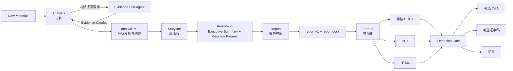
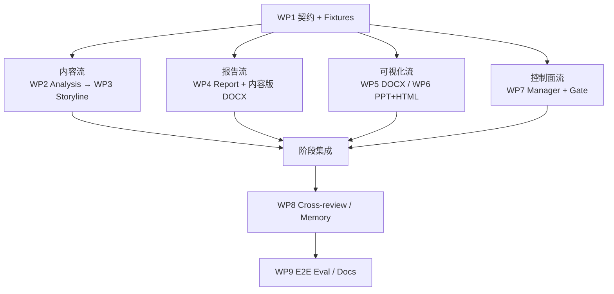

# 文档优先架构迭代方案

> 状态：核心实现已完成，v0.3 已设为默认活动 profile
> 建议版本：`v0.3`  
> 日期：2026-07-02  
> 核心链路：`analysis → storyline → report → format`

## 实施状态（2026-07-02）

已完成 v0.3 schema/fixture、四阶段 profile-aware runtime、Analysis 内部
Evidence 子任务、Storyline、Report、DOCX 内容报告、document/PPT/HTML
三种 Format 渲染、Manager 四阶段路由、Format 后扩展 gate，以及新旧链路的
cross-review 与 memory routing。

默认启动：

```bash
python -m presentation_agent.cli report start \
  --brief-file path/to/raw_brief.json
```

v0.3 是唯一可执行 profile；旧版 Skill 与兼容 profile 已移除。

## 0. 已确认决策

以下内容不再作为待讨论项，直接作为本轮改造约束。

| ID | 已确认决策 |
|---|---|
| D1 | 顶层生产环节固定为四个：`analysis → storyline → report → format` |
| D2 | 中文名固定为：**分析 → 故事线 → 报告产出 → 可视化** |
| D3 | 使用新的 Worker ID：`analysis`、`storyline`、`report`、`format` |
| D4 | Evidence 不再是 Manager 可单独派发的顶层 Worker；Analysis 在存在 Raw Materials 且没有可复用 Evidence Catalog 时，固定调用一次 Evidence 子 agent |
| D5 | 默认交付目标为 `document` |
| D6 | Report 负责形成完整、严肃、内容正确的分析报告；Format 可以继续输出 DOCX，并负责对文档做正式版式和可视化增强 |
| D7 | PPT / HTML 也必须基于 Report 产物进行转译，不从 Raw Materials 或旧 Page Content 直接生成 |
| D8 | Q&A 和逐字稿不进入默认四阶段；Format 核心材料完成后，默认出现扩展选择 gate |

一句话目标：

> 先把 Raw Materials 转化为可信的分析判断和完整报告，再把报告转译为精装 DOCX、PPT 或 HTML。

---

# 第一部分：背景与推导

## 1. 当前架构为什么需要调整

当前主链路是：

```text
argument_synthesis
  → storyline_design
  → page_filling
  → format
  → qa_preparation
  → speaker_script
```

主要问题不是 Worker 数量，而是生产逻辑仍偏向 Slide-first：

1. `storyline.pages` 过早进入分页；
2. `page_filling` 围绕单页填充，而不是完整分析报告；
3. DOCX 与 PPT 共用 `material_units`，生成的文档容易像“纵向排列的幻灯片”；
4. Raw Materials 中往往没有现成观点，现有“论点提炼”容易跳过真正的数据分析和观点讨论；
5. Q&A、逐字稿默认进入链路，稀释了 Raw Materials → Document 这一高价值主任务。

## 2. 为什么 Analysis 和 Storyline 必须分开

Raw Materials 常见输入包括：

- 访谈 notes；
- 问卷或用户研究；
- 原始 Excel / CSV 数据；
- 业务复盘材料；
- 行业与竞品资料；
- 尚未形成统一观点的多方材料。

它们首先需要回答：

```text
材料说明了什么？
哪些现象是真实的？
为什么发生？
有哪些竞争性解释？
对业务意味着什么？
哪些判断仍需讨论？
```

这是 Analysis 的职责。

Storyline 回答的是另一组问题：

```text
最终主张什么？
Executive Summary 怎么写？
Message Pyramid 如何搭建？
论证按什么顺序展开？
报告应该包含哪些章节和内容单元？
```

这是叙事和论证组织职责。两者如果合并，模型容易在材料尚未分析清楚时直接进入“写结论、搭结构”，从而得到结构完整但洞察薄弱的报告。

因此，本轮不合并 Analysis 与 Storyline。

## 3. 为什么 Evidence 应成为 Analysis 的内部子 agent

Evidence 的工作是：

- 完整读取材料；
- 拆分 source units；
- 提取文本、表格、图片和引用；
- 建立来源索引；
- 标记 unresolved units；
- 不形成业务判断。

它本身没有独立的用户交付价值，不应该占据一个顶层阶段，也不需要 Manager 单独向用户汇报。

但这项能力仍需保留为独立 Skill / 子 agent，因为：

- 长材料、多模态和访谈场景需要隔离上下文；
- 信息整理与战略判断需要不同 rubric；
- Evidence Catalog 对可追溯和防遗漏仍然重要；
- 未来可以独立优化解析和取数能力。

目标关系是：

```text
Manager
  → 派发 Analysis Worker 与输入材料
  → 不单独规划 Evidence
Analysis Worker
      → 执行输入 readiness check
      → 已有 Evidence Catalog：直接复用
      → 有 Raw Materials：调用 Evidence Sub-agent 一次
      → 没有材料：记录证据缺口
      → 消费 Evidence Catalog
      → 完成分析判断
  → Manager 只验收 Analysis 结果
```

Evidence Catalog 是 Analysis 的内部中间产物，不进入顶层 execution plan。

### 3.1 单次确定性调用规则

Evidence 不再使用 `required / auto / skip` 策略，也不设计预算和多轮状态机。Analysis 只执行以下固定判断：

```text
if 输入中已有 Evidence Catalog:
    直接复用，不调用 Evidence
elif 输入中存在 Raw Materials:
    调用 Evidence 一次
else:
    不调用 Evidence，记录 evidence gap
```

职责边界：

| 角色 | 负责 | 不负责 |
|---|---|---|
| Manager | 把完整材料和已有 artifact 交给 Analysis；验收 Analysis 是否透明说明证据覆盖 | 不判断是否调用 Evidence，不创建独立 Evidence 任务 |
| Analysis | 执行固定前置判断、创建一次子任务、消费并验收 Evidence Catalog | 不自动重试或发起第二轮补取 |
| Evidence | 读取、拆分、提取和索引材料，报告未解析单元 | 不形成观点、so what 或建议 |

若 Evidence 存在 unresolved units：

- 不影响核心判断：Analysis 带 caveat 继续；
- 影响核心判断：Analysis 向 Manager 返回 blocked / open question；
- 不在内部自动发起第二轮 Evidence。

## 4. 为什么 Format 仍然应支持 DOCX

Report 和 Format 的职责不是“一个写 Word、另一个只写 PPT”，而是：

```text
Report = 内容正确、论证完整、可独立阅读
Format = 载体表达、视觉组织、正式交付
```

因此 DOCX 需要两层产物：

1. Report 生成内容完整、基础排版的 `report.docx`；
2. Format(document) 基于同一语义 artifact 生成 `report_formatted.docx`。

Format(document) 可负责：

- 封面、目录、标题层级；
- 字体、颜色、留白和分页；
- 表格样式；
- 图表重绘；
- SVG 框架图、流程图、矩阵和示意图；
- 关键结论 callout；
- 图注、来源、页眉页脚和页码；
- 图文混排与跨页控制。

Format 不得改变 Report 的核心结论、数据、证据强度和 caveat。

---

# 第二部分：明确的目标架构

## 5. 顶层链路



## 6. 四个 Worker 的稳定边界

| Worker | 中文名 | 核心问题 | 正式产物 |
|---|---|---|---|
| `analysis` | 分析 | 材料说明了什么，so what 是什么？ | `analysis.v1` |
| `storyline` | 故事线 | 最终主张什么，如何形成金字塔论证？ | `storyline.v3` |
| `report` | 报告产出 | 如何写成完整、严肃、可独立阅读的报告？ | `report.v1` + `report.docx` |
| `format` | 可视化 | 如何转译为正式 DOCX、PPT 或 HTML？ | `formatted_material.v2` + 正式文件 |

### 6.1 Analysis

职责：

1. 识别输入材料类型、完整性和分析问题；
2. 需要时调用 Evidence 子 agent；
3. 对原始数据、访谈和材料进行比较、拆解和交叉验证；
4. 形成发现、解释、候选观点和 so what；
5. 区分事实、发现、假设、推论和建议；
6. 暴露反证、替代解释、置信度和数据缺口；
7. 标记需要用户讨论或 Manager 决策的分歧。

不负责：

- 写最终 Executive Summary；
- 设计 message pyramid；
- 设计报告章节；
- 写完整报告正文；
- 做视觉表达。

建议 `analysis.v1` 至少包含：

```text
analysis_questions
material_readiness
evidence_catalog_ref
evidence_execution
  - invoked
  - invocation_reason
  - coverage_summary
  - unresolved_units
findings[]
  - finding_id
  - statement
  - finding_type
  - supporting_evidence[]
  - counter_evidence[]
  - alternative_explanations[]
  - confidence
  - so_what
  - decision_relevance
viewpoint_candidates[]
decision_tensions[]
assumptions[]
data_gaps[]
discussion_points[]
open_questions[]
```

#### Evidence 子 agent 触发条件

Analysis 不再判断材料“够不够复杂”，只判断输入形态：

- 已有 `evidence_catalog`：直接复用；
- 有 Raw Materials、没有 `evidence_catalog`：调用 Evidence 一次；
- 没有 Raw Materials：不调用，记录证据缺口。

简单材料也遵循同一规则，以换取稳定、可测试的行为。Analysis 不在分析过程中自动追加 Evidence 子任务。

#### 内部运行目录

建议保持隔离：

```text
tasks/<task_id>_analysis/
├── input.json
├── artifact.json
├── review.json
└── subtasks/
    └── evidence_harvester/
        ├── input.json
        ├── evidence_catalog.json
        └── review.json
```

Evidence 继续拥有自己的 Skill、schema、rubric 和 memory，但从 `available_workers` 和 Manager route 中移除。子任务及其 coverage 和 unresolved units 必须进入 Analysis 的审计记录，不能成为不可见的内部调用。

### 6.2 Storyline

职责：

1. 读取 Analysis 已支持的发现和观点候选；
2. 收敛 core answer 和 expected action；
3. 生成 Executive Summary；
4. 建立 dynamic message pyramid；
5. 设计 narrative sequence；
6. 展开报告章节与内容单元；
7. 检查塔尖、支撑论点、证据和章节的一致性。

不负责：

- 重新分析 Raw Materials；
- 新增 Analysis 未支持的结论；
- 写完整正文；
- 直接生成 PPT 页面；
- 选择具体视觉形式。

建议 `storyline.v3` 至少包含：

```text
executive_summary
  - context
  - core_answer
  - key_findings
  - implications
  - expected_action
message_pyramid
  - apex
  - supporting_messages[]
  - evidence_links[]
narrative_sequence[]
report_outline
  - sections[]
      - section_id
      - section_question
      - section_thesis
      - supporting_points[]
      - finding_refs[]
      - evidence_refs[]
      - counterarguments[]
      - caveats[]
      - transition_from
      - transition_to
appendix_plan
alignment_audit
upstream_revision_requests
open_questions
```

关键约束：

- Storyline 输出的是章节和内容单元，不是 `pages[]`；
- Executive Summary 与 message pyramid 在同一 artifact 内生成和验收；
- 如果 Analysis 不足以支撑塔尖结论，必须退回 Analysis。

### 6.3 Report

职责：

1. 按 Storyline 展开完整章节；
2. 写出可独立阅读的连续正文；
3. 将主张、证据、解释、影响和边界写成完整论证链；
4. 形成方法论、表格、图表数据、引用、反方和 caveat；
5. 维护 claim / finding / evidence 的可追溯关系；
6. 生成结构化 `report.v1`；
7. 生成内容完整、基础排版的 `report.docx`。

Report 的 DOCX 是“内容版”：

- 内容正确且完整；
- 具备基础标题、段落、表格、来源和附录；
- 可以直接阅读和评审；
- 不追求复杂视觉设计；
- 即使 Format 尚未执行，也能验证 Raw Materials → Document 的核心价值。

建议 `report.v1` 至少包含：

```text
report_metadata
executive_summary
sections[]
  - section_id
  - heading
  - section_thesis
  - narrative_blocks[]
  - tables[]
  - figure_specs[]
  - section_conclusion
  - transition
claims[]
findings[]
source_registry[]
claim_evidence_map[]
methodology
assumptions
data_gaps
risks_and_counterarguments
recommendations
appendices[]
format_handoff
quality_checks[]
```

`narrative_blocks` 至少支持：

```text
paragraph
bullet_group
quote
table
figure_placeholder
callout
method_note
caveat
```

不负责：

- 为了视觉效果压缩或改写论证；
- 选择 PPT layout；
- 制作 SVG、复杂图表或正式品牌版式；
- 隐藏数据缺口。

### 6.4 Format

职责：

1. 读取 `report.v1`，而不是重新读取 Raw Materials 形成观点；
2. 根据 `delivery_target` 编译唯一载体能力；
3. 生成正式 DOCX、PPT 或 HTML；
4. 创建图表、SVG 框架图、矩阵、流程图和视觉摘要；
5. 维护每个视觉单元到 report section / claim / evidence 的映射；
6. 记录压缩、重组和省略决策；
7. 真实渲染并执行视觉 QA。

Format 的三类目标：

| Target | 主要行为 |
|---|---|
| `document` | 保留完整正文，增强版式、表格、图表、SVG 框架图和阅读体验 |
| `ppt` | 选择、压缩和重组为逐页演示叙事 |
| `html` | 转为模块化、可导航或可交互的网页 |

建议一个 Format task 只处理一个 target，以保持 Skill、工具和 QA 单一：

```text
format(document)
format(ppt)
format(html)
```

同一个 run 可以有多个 Format task。默认：

```json
{
  "delivery_targets": ["document"]
}
```

用户要求 PPT 时：

```json
{
  "delivery_targets": ["document", "ppt"]
}
```

Format 输出建议升级为 `formatted_material.v2`，至少新增：

```text
delivery_target
source_report_ref
source_section_ids
source_claim_ids
visual_assets[]
compression_decisions[]
omitted_content_register[]
caveat_preservation[]
render_plan
render_result
quality_checks[]
```

## 7. Manager 与用户 Gate

新的默认状态机：

```text
brief confirmation
  → planning
  → plan gate
  → analysis
  → storyline
  → report
  → format(document by default)
  → requested additional format targets
  → extension gate
  → optional Q&A / speaker script
  → final gate
```

### 7.1 Manager 可见 Worker

顶层可见：

```text
analysis
storyline
report
format
qa_preparation
speaker_script
```

顶层不可见：

```text
evidence_harvester
```

Evidence 只能由 Analysis 内部触发。

### 7.2 Evidence 内部调用

Manager 在 planning 时只需把以下内容完整交给 Analysis：

```text
raw_materials[]
existing_artifacts[]
analysis_objective
acceptance_criteria[]
```

Manager 不设置 Evidence 策略，也不调度或单独验收 Evidence。验收 Analysis 时只检查：

- Raw Materials 存在且没有既有 Evidence Catalog 时，是否执行了一次 Evidence；
- coverage 和 unresolved units 是否透明；
- Analysis 判断是否能追溯到 Evidence；
- 关键 unresolved units 是否被正确升级为阻塞。

若 Evidence 质量不足，应返工 Analysis；Analysis 可以在新的 revision round 中重新执行完整流程，但单次 Analysis round 内不自动重复调用 Evidence。

### 7.3 Extension Gate

所有 Format targets 完成后，Manager 展示：

- 已生成文件；
- Executive Summary；
- 关键 data gaps 和 caveats；
- Q&A / 逐字稿是否值得生成的建议；
- 四个选项：Q&A、逐字稿、两者、暂不生成。

Q&A 与逐字稿的依赖：

- Q&A 依赖最终材料；
- 逐字稿可只依赖最终材料；
- 如果两者都选，先运行 Q&A，再让逐字稿吸收高风险问题；
- 它们不进入初始 execution plan，用户选择后再追加。

---

# 第三部分：明确 TODO

## 8. 工作包总览

| WP | 工作包 | 主要产出 | 依赖 |
|---|---|---|---|
| WP0 | 基线冻结 | Raw→DOCX golden cases、旧链路快照、验收样例 | 无 |
| WP1 | 核心契约 | 四 Worker 定义、四套 schema、charter v2、fixture | WP0 |
| WP2 | Analysis + Evidence 子 agent | Analysis Skill、内部调度、analysis.v1、review | WP1 |
| WP3 | Storyline | Storyline v3 Skill、Executive Summary、message pyramid | WP1；集成依赖 WP2 |
| WP4 | Report | Report Skill、report.v1、内容版 DOCX renderer | WP1；集成依赖 WP3 |
| WP5 | Format(document) | 精装 DOCX、图表、SVG / diagram、视觉 QA | WP1；集成依赖 WP4 |
| WP6 | Format(ppt/html) | Report→PPT / HTML 转译与追溯 | WP1；集成依赖 WP4 |
| WP7 | Manager / Runtime | 新 route、Evidence 隐藏、multi-target Format、extension gate | WP1；最终集成依赖 WP2-WP6 |
| WP8 | Context / Review / Memory | 投影上下文、跨阶段检查、memory 迁移 | WP1；按 Worker 跟随 WP2-WP6 |
| WP9 | Eval / UI / Docs | Report Eval、Format Eval、Web Cockpit、README | WP2-WP8 |
| WP10 | Legacy 清理 | 旧 ID / schema / pipeline 路径归档或删除 | WP9 验证后 |

## 9. WP0：冻结基线

TODO：

- [ ] 选择 2-3 个代表性 Raw Materials 案例；
- [ ] 至少包含一个访谈 / 定性材料案例；
- [ ] 至少包含一个 Excel / 数据分析案例；
- [ ] 至少包含一个混合材料 deep-dive 案例；
- [ ] 保存当前 Raw→DOCX / PPT 输出；
- [ ] 定义人工报告的最低质量样例；
- [ ] 固化核心评测维度和回归 fixture。

完成标准：

- 改造前后可以用相同输入对比；
- 不依赖某一个留存案例判断全部质量。

## 10. WP1：核心契约与配置

TODO：

- [ ] 新建 `analysis.v1`；
- [ ] 新建 `storyline.v3`；
- [ ] 新建 `report.v1`；
- [ ] 新建或升级 `formatted_material.v2`；
- [ ] 新建 `report_charter.v2`；
- [ ] 新增 `delivery_targets`，默认 `["document"]`；
- [ ] 定义四个 Worker 的 input / output contract；
- [ ] 更新 `configs/agents.json`；
- [ ] 更新 `configs/capabilities.json`；
- [ ] 更新 `configs/context_requirements.json`；
- [ ] 为每个下游 Worker 准备可独立开发的 fixture。

主要文件：

```text
configs/agents.json
configs/capabilities.json
configs/context_requirements.json
skills/manager/schemas/report_charter.v2.json
skills/analysis/schemas/analysis.v1.json
skills/storyline/schemas/storyline.v3.json
skills/report/schemas/report.v1.json
skills/format/schemas/formatted_material.v2.json
tests/fixtures/v0_3/
```

完成标准：

- 四阶段 schema 可以单独校验；
- fixture 足以让 WP2-WP7 并行开发；
- 新 run 不再写 `storyline.pages` 或 `page_content.v2`。

## 11. WP2：Analysis 与内部 Evidence

TODO：

- [ ] 新建 `skills/analysis/`；
- [ ] 将旧 argument 的分析判断能力迁入 Analysis；
- [ ] 增加 finding、so what、反证、替代解释和 confidence rubric；
- [ ] 增加“复用已有 Catalog / 有 Raw Materials 调用一次 / 无材料记录 gap”的固定判断；
- [ ] 实现 Analysis 内部子任务目录；
- [ ] 限制单个 Analysis round 最多调用一次 Evidence；
- [ ] 复用 `skills/evidence_harvester/`；
- [ ] 从 Manager available workers 移除 Evidence；
- [ ] Analysis review 同时校验 Evidence coverage 与分析质量；
- [ ] 将 Evidence invocation reason、coverage 和 unresolved units 写入 `analysis.v1`；
- [ ] 文件不可读或证据仍不足时向 Manager 返回 blocked；
- [ ] 增加 `discussion_points` 和 `decision_tensions`；
- [ ] 增加 Analysis→Storyline handoff。

主要文件：

```text
skills/analysis/
skills/evidence_harvester/
presentation_agent/step.py
presentation_agent/spawn.py
presentation_agent/context/assembler.py
presentation_agent/machine_check.py
tests/test_analysis.py
tests/test_analysis_evidence_subtask.py
```

完成标准：

- Manager 只派发一次 Analysis；
- 有 Raw Materials 且没有 Catalog 时，稳定生成内部 Evidence Catalog；
- 已有 Catalog 时不重复调用；
- 没有材料时明确记录证据缺口；
- 单个 Analysis round 不会触发第二轮 Evidence；
- Evidence 子任务可审计但不形成用户环节；
- Analysis artifact 能独立说明观点如何从证据得出。

## 12. WP3：Storyline

TODO：

- [ ] 将旧 `storyline_design` 迁移为 `storyline`；
- [ ] 将 Executive Summary 正式归属 Storyline；
- [ ] 使用 Analysis findings 建立 message pyramid；
- [ ] 用 `sections[]` / `content_units[]` 替代 `pages[]`；
- [ ] 增加 Analysis finding coverage；
- [ ] 增加 Executive Summary ↔ pyramid ↔ outline 一致性检查；
- [ ] 增加 `upstream_revision_requests`，证据不足时退回 Analysis；
- [ ] 迁移 storyline memory 和 rubrics。

主要文件：

```text
skills/storyline/
presentation_agent/cross_review.py
presentation_agent/routing.py
tests/test_storyline_v3.py
```

完成标准：

- Executive Summary 和 message pyramid 同一轮生成；
- Storyline 不新增 Analysis 未支持的观点；
- 输出不含页面布局和图表设计。

## 13. WP4：Report 与内容版 DOCX

TODO：

- [ ] 将 `page_filling` 重建为 `report`，不能只改名；
- [ ] 新建 Report Skill 和 report-specific rubrics；
- [ ] 生成连续正文和完整章节；
- [ ] 支持表格、引用、方法说明、caveat 和附录；
- [ ] 维护 claim / finding / evidence trace；
- [ ] 新建语义化 report renderer；
- [ ] 输出内容版 `report.docx`；
- [ ] 对 DOCX 执行打开、文本提取和页面渲染检查；
- [ ] 删除 Page Filling draft render 语义。

主要文件：

```text
skills/report/
presentation_agent/renderers/report_docx.py
presentation_agent/step.py
presentation_agent/cross_review.py
tests/test_report.py
tests/test_report_docx.py
```

完成标准：

- Word 不再是逐页 material units 的纵向排列；
- 即使不看 PPT，也能完整理解分析逻辑；
- Report 产物可以独立通过内容和视觉评测。

## 14. WP5：Format(document)

TODO：

- [ ] 保留并重构 `format.document` capability；
- [ ] 输入改为 `report.v1` + 内容版 DOCX；
- [ ] 生成精装 `report_formatted.docx`；
- [ ] 增加封面、目录、页眉页脚和页码；
- [ ] 增加表格样式和跨页控制；
- [ ] 增加图表生成；
- [ ] 增加 SVG 框架图 / 流程图 / 矩阵图；
- [ ] SVG 不兼容时提供 PNG fallback；
- [ ] 增加 source claim mapping；
- [ ] 增加 Word 视觉 QA。

主要文件：

```text
skills/atomic/format/document/
skills/format/
presentation_agent/renderers/docx.py
presentation_agent/renderers/diagram.py
presentation_agent/evaluation/adapters.py
tests/test_format_document.py
```

完成标准：

- 精装 DOCX 与 `report.v1` 内容一致；
- 图表和框架图引用真实数据或真实 report claims；
- Format 失败时不破坏内容版 DOCX。

## 15. WP6：Format(ppt/html)

TODO：

- [ ] Format 输入从 `page_content.v2` 改为 `report.v1`；
- [ ] Report section → slide / module 映射；
- [ ] 增加 compression decisions；
- [ ] 增加 omitted content register；
- [ ] 增加 caveat preservation；
- [ ] 保留现有 PPT / HTML renderer 中可复用的能力；
- [ ] 更新 visual judge。

主要文件：

```text
skills/atomic/format/ppt/
skills/atomic/format/html/
skills/format/
presentation_agent/renderers/ppt.py
presentation_agent/renderers/html.py
presentation_agent/cross_review.py
tests/test_format_translation.py
```

完成标准：

- PPT / HTML 可追溯到 report section / claim；
- 压缩不改变结论强度；
- 关键 caveat 不因载体转换消失。

## 16. WP7：Manager 与 Runtime

TODO：

- [ ] 默认 route 改为四阶段；
- [ ] `available_workers` 隐藏 Evidence；
- [ ] Manager 将 Raw Materials 和已有 artifacts 完整传给 Analysis；
- [ ] Manager acceptance 校验 Analysis 的 Evidence 调用记录和 coverage；
- [ ] Manager planning 支持 `delivery_targets`；
- [ ] 每个 Format task 只处理一个 target；
- [ ] document 为默认 target；
- [ ] 所有 Format targets 完成后才进入 extension gate；
- [ ] Q&A / Script 改为 gate 后追加任务；
- [ ] Speaker Script 允许 Q&A 缺省；
- [ ] 更新 brief confirmation、status 和用户提示；
- [ ] legacy pipeline 保留一版兼容。

主要文件：

```text
skills/manager/
presentation_agent/manager.py
presentation_agent/launch.py
presentation_agent/pipeline.py
presentation_agent/cli.py
skills/qa_preparation/
skills/speaker_script/
tests/test_manager.py
tests/test_pipeline.py
```

完成标准：

- 新 run 不会默认执行 Q&A / Script；
- document 请求跑完四阶段；
- PPT 请求产出 document + PPT；
- Evidence 不会成为单独的用户环节。
- Evidence 的复用、单次调用和无材料三条路径均有测试。

## 17. WP8：Context、Cross-review 与 Memory

TODO：

- [ ] Raw Materials / Evidence → Analysis 投影；
- [ ] Evidence 子任务的输入、输出和调用原因进入 Analysis audit manifest；
- [ ] Analysis → Storyline 投影；
- [ ] Storyline → Report 投影；
- [ ] Report → Format 投影；
- [ ] 对 Analysis 保留足够 granular data；
- [ ] 增加 Analysis finding → Storyline message 检查；
- [ ] 增加 Storyline section → Report section 检查；
- [ ] 增加 Report claim → Format unit 检查；
- [ ] 迁移 memory owner；
- [ ] 保留 legacy owner 和 case anchors。

建议 memory 映射：

| 旧 owner | 新 owner |
|---|---|
| `evidence_harvester` | 保留，作为 Analysis 内部子 agent memory |
| `argument_synthesis` 的分析、结论、证据强度 | `analysis` |
| `argument_synthesis` 的 Executive Summary 表达 | `storyline` |
| `storyline_design` | `storyline` |
| `page_filling` 的正文、论证链、来源 | `report` |
| `page_filling` 的图表、主视觉、上屏意图 | `format` |
| `format` | `format`，按 document / ppt / html capability scope 区分 |

完成标准：

- 下游只获得所需字段，不继承全部历史 artifact；
- granular data 不因 preview 丢失；
- Evidence 内部调用保留 invocation reason、coverage 和 unresolved units 审计；
- 旧 memory 不整库复制到单一新 Worker。

## 18. WP9：Eval、Web 与核心文档

TODO：

- [ ] 新增 Analysis Eval；
- [ ] 新增 Storyline alignment Eval；
- [ ] 新增 Report Content Eval；
- [ ] 新增 Report DOCX Visual Eval；
- [ ] 新增 Format Translation Eval；
- [ ] Web Cockpit 展示四阶段；
- [ ] Analysis 节点内部展示 Evidence subtask；
- [ ] 更新 README；
- [ ] 更新 GUIDEBOOK；
- [ ] 更新架构图和 CLI 示例。

评测重点：

| 环节 | 重点 |
|---|---|
| Analysis | 洞察质量、证据支持、反证、so what |
| Storyline | ES / pyramid / outline 一致性 |
| Report | 完整性、严肃性、段落质量、可追溯 |
| Format(document) | 图文表达、可读性、版式、图表真实性 |
| Format(ppt/html) | 转译忠实度、信息压缩、视觉表达 |

---

# 第四部分：串行与并行关系

## 19. 必须串行的产品依赖

真实集成链路必须按顺序成立：

```text
WP0 基线
  → WP1 契约冻结
  → WP2 Analysis 可用
  → WP3 Storyline 接通
  → WP4 Report 接通
  → WP5 / WP6 Format 接通
  → WP7 Manager 全链路接通
  → WP9 E2E 验收
  → WP10 Legacy 清理
```

以下产物存在硬依赖：

```text
analysis.v1
  → storyline.v3
  → report.v1
  → formatted_material.v2
```

上游 schema 未冻结前，不应开始真实集成。

## 20. 可以并行的开发流

WP1 完成并提供 fixture 后，可以分为四条并行流：



并行开发条件：

| 可并行项 | 条件 |
|---|---|
| Analysis 与 Storyline Skill | Storyline 使用冻结的 `analysis.v1` fixture |
| Report 与 Storyline 实现 | Report 使用冻结的 `storyline.v3` fixture |
| Format(document) 与 Report 实现 | Format 使用冻结的 `report.v1` fixture |
| Format(document) 与 Format(ppt/html) | 共用 v2 contract，但 renderer 和 capability 文件分离 |
| Manager 与四个 Worker | Manager 使用 mock artifacts 验证 route 和 gate |
| Eval scaffolding 与 Worker 开发 | rubric 可并行，真实 benchmark 要等对应 Worker 接通 |

必须避免多人同时修改的热点：

```text
configs/agents.json
configs/context_requirements.json
presentation_agent/manager.py
presentation_agent/step.py
presentation_agent/cross_review.py
```

建议这些文件分别由 WP1、WP7、WP8 的负责人集中合并。

## 21. 推荐实施里程碑

### Milestone A：Raw Materials → 内容版 Word

范围：

```text
Analysis → Storyline → Report → report.docx
```

目的：

- 先验证分析和报告价值；
- 暂不等待复杂视觉；
- 用真实案例确定 `analysis.v1`、`storyline.v3`、`report.v1` 是否合理。

### Milestone B：精装 DOCX

范围：

```text
Report → Format(document) → report_formatted.docx
```

目的：

- 验证图表、SVG 框架图和正式报告版式；
- 使默认 document 交付达到可直接使用水平。

### Milestone C：PPT / HTML

范围：

```text
Report → Format(ppt/html)
```

目的：

- 验证从完整报告到演示载体的转译；
- 重点评估忠实度和信息压缩，而不是重新分析。

### Milestone D：扩展与迁移

范围：

```text
Extension Gate → Q&A / Script → Final
```

并完成：

- memory 迁移；
- UI / README / GUIDEBOOK；
- legacy 清理决策。

---

# 第五部分：迁移与验收

## 22. 旧新映射

| 旧对象 | 新对象 | 处理方式 |
|---|---|---|
| `evidence_harvester` 顶层 Worker | Analysis 内部子 agent | Skill 保留，Manager route 移除 |
| `argument_synthesis` | `analysis` | 迁移分析判断职责 |
| `storyline_design` | `storyline` | 吸收 Executive Summary，升级 schema |
| `page_filling` | `report` | 重建，不做简单改名 |
| `format` | `format` | 保留 ID，输入改为 Report，继续支持 document / ppt / html |
| `qa_preparation` | 可选扩展 | 默认不规划 |
| `speaker_script` | 可选扩展 | 默认不规划，Q&A 改为可选输入 |

建议保留一个版本的只读兼容：

- 旧 run 可以查看和 resume；
- 旧 `output_format` 映射到 `delivery_targets`；
- 旧 schema 不再用于新 run；
- 旧 memory 迁移时不删除原数据；
- legacy pipeline 与 canonical v0.3 path 在测试中明确分开。

## 23. E2E 验收标准

### 23.1 路由

- [ ] 默认 route 为 `analysis → storyline → report → format(document)`；
- [ ] Evidence 不出现在 Manager plan 和用户进度中；
- [ ] 已有 Evidence Catalog 时直接复用；
- [ ] 有 Raw Materials、没有 Catalog 时调用 Evidence 一次；
- [ ] 没有 Raw Materials 时记录证据缺口；
- [ ] 单个 Analysis round 不会自动多轮调用 Evidence；
- [ ] Q&A / Script 不在初始计划中；
- [ ] 所有 Format targets 完成后出现 extension gate。

### 23.2 Analysis

- [ ] 输出包含 findings、so what、证据、反证、替代解释和 confidence；
- [ ] 输出记录 Evidence invocation reason、coverage 和 unresolved units；
- [ ] 不把访谈个例写成量化结论；
- [ ] 关键判断可以追溯到 source；
- [ ] 分歧和不确定性不会被隐藏。

### 23.3 Storyline

- [ ] Executive Summary 与 message pyramid 同一 artifact；
- [ ] 每个 supporting message 引用 Analysis finding；
- [ ] 输出按章节和内容单元组织，不是 pages；
- [ ] 不新增 Analysis 未支持的关键观点。

### 23.4 Report

- [ ] Word 可独立阅读；
- [ ] 不是 dummy page 或 bullets 集合；
- [ ] Executive Summary、正文、方法、反方、caveat、来源和附录完整；
- [ ] 关键数字、表格和引用可追溯；
- [ ] `report.docx` 真实生成并可打开。

### 23.5 Format(document)

- [ ] 生成 `report_formatted.docx`；
- [ ] 图表使用真实数据；
- [ ] SVG / diagram 与报告论证相关；
- [ ] 视觉增强不改变内容；
- [ ] 来源、caveat、图注和表注保留；
- [ ] Format 失败时内容版 Word 仍可交付。

### 23.6 Format(ppt/html)

- [ ] 每个展示单元能追溯到 report section / claim；
- [ ] 核心数字与 Report 一致；
- [ ] 压缩和省略有记录；
- [ ] caveat 不因转译消失；
- [ ] 最终文件真实渲染并通过视觉 QA。

---

## 24. 本轮不做

为了优先做好 Raw Materials → Document，本轮不做：

- Raw Materials 绕过 Report 直接生成 PPT / HTML；
- Evidence 作为独立用户环节；
- 默认自动生成 Q&A / 逐字稿；
- 一次性删除全部 legacy schema 和旧 run；
- 在 schema 未冻结前同时重写所有 runtime；
- 为追求演示效果而降低 Analysis 和 Report 的质量门槛。

## 25. 下一步

下一步先执行 WP0 和 WP1：

1. 选择 golden cases；
2. 冻结 `analysis.v1`、`storyline.v3`、`report.v1`、`formatted_material.v2`；
3. 更新 Agent / Context 配置；
4. 生成可供并行开发的 fixtures；
5. 再按 WP2-WP7 分工实施。

在契约冻结之前，不建议直接开始大规模改 Skill 或 Runtime。

## 26. 推荐任务派发顺序

### Wave 0：单人冻结契约

只派发一个任务，避免多人同时修改 schema 和核心配置。

```text
任务：执行 WP0 + WP1
目标：冻结四阶段契约并准备下游 fixtures
允许修改：configs/、新 schemas、tests/fixtures/v0_3/
暂不修改：具体 Worker Skill、Manager runtime、renderer
完成标志：四套 schema 可校验，fixtures 可供下游独立测试
```

### Wave 1：四条并行开发流

WP1 合并后，可同时派发：

| 任务 | 范围 | 主要文件 | 禁止越界 |
|---|---|---|---|
| A：Analysis | WP2 | `skills/analysis/`、Evidence 内部调用、Analysis tests | 不改 Storyline / Report / Format |
| B：Storyline | WP3 | `skills/storyline/`、`test_storyline_v3.py` | 只使用冻结的 `analysis.v1` fixture |
| C：Report | WP4 | `skills/report/`、`report_docx.py`、Report tests | 只使用冻结的 `storyline.v3` fixture |
| D：Manager | WP7 的路由部分 | Manager Skill、`manager.py`、route / gate tests | 使用 mock artifacts，不改 Worker Skill |

Wave 1 的逻辑集成仍按：

```text
Analysis → Storyline → Report
```

但开发可以依赖 fixtures 并行进行。

### Wave 2：Format 共用层

先由一个任务处理所有 Format target 共用的改造：

```text
任务：Format Core
目标：把 Format 输入从 page_content.v2 改为 report.v1
产出：formatted_material.v2 共用字段、source mapping、render dispatch
暂不深入：具体 DOCX / PPT / HTML 视觉实现
```

共用层完成后再并行：

| 任务 | 范围 |
|---|---|
| E：Format(document) | WP5，精装 DOCX、图表、SVG / diagram、Word QA |
| F：Format(ppt/html) | WP6，Report→PPT / HTML 转译、压缩记录和视觉 QA |

如果多人协作，E 和 F 不应同时修改 Format 共用 schema、Core Skill 或 renderer dispatcher；这些文件归 Format Core 任务。

### Wave 3：集成与质量

四阶段和 Format targets 都完成后，串行派发：

1. **Integration**：接通真实 artifacts，完成 WP8 context projection、cross-review 和 memory migration；
2. **Manager Completion**：补齐 multi-target Format 和 extension gate 的真实集成；
3. **Eval**：执行 WP9 的分环节评测和 golden case 回归；
4. **Docs / UI**：更新 README、GUIDEBOOK、Web Cockpit 和架构图；
5. **Legacy Audit**：评估 WP10，确认哪些旧路径删除、隐藏或保留只读。

### 派发纪律

每个开发任务都应包含：

- 唯一负责的 WP 和文件范围；
- 明确的输入 fixture；
- 不允许修改的共享文件；
- 对应测试；
- artifact / schema 完成标准；
- 与上下游的 handoff 字段；
- 不顺手清理无关 legacy 代码。

共享热点只交给一个 owner：

```text
configs/agents.json
configs/context_requirements.json
presentation_agent/manager.py
presentation_agent/step.py
presentation_agent/cross_review.py
skills/format/SKILL.md
skills/format/schemas/formatted_material.v2.json
```
